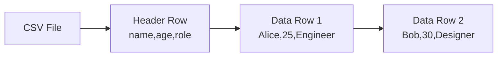
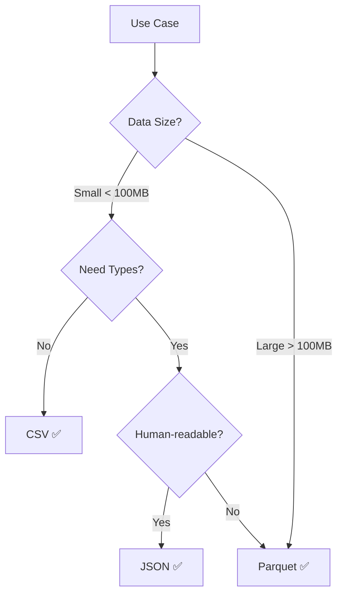

# CSV File Format

## Overview
CSV (Comma-Separated Values) is a simple, **text-based** format for tabular data. Human-readable, universally supported, ideal for small datasets and data interchange.

## Key Characteristics

| Feature | Description |
|---------|-------------|
| **Text-based** | Plain ASCII/UTF-8, any text editor |
| **Row-oriented** | Data stored row by row |
| **Delimiter-separated** | Comma, tab, pipe, semicolon |
| **No types** | Everything stored as text |
| **No schema** | Optional header row |

## File Structure

## Handling Special Cases

| Case | Solution | Example |
|------|----------|---------|
| Comma in value | Quote the value | `"Boston, MA"` |
| Quote in value | Double quotes | `"She said ""Hi"""` |
| Newline in value | Quote the value | `"Line1\nLine2"` |
| Empty value | Leave blank | `Alice,,Smith` |

## Advantages vs Disadvantages

| ✅ Advantages | ❌ Disadvantages |
|---------------|------------------|
| Human-readable | No data types |
| Universal support | No schema |
| No dependencies | Large file size |
| Version control friendly | Slow parsing |
| Easy to edit manually | No nested data |
| Fast writes | Ambiguous formats |

## Comparison with Other Formats

| Feature | CSV | [[41.01 Parquet File Format\|Parquet]] | [[41.03 JSON File Format\|JSON]] |
|---------|-----|---------|------|
| Storage | Row | Column | Document |
| Readable | ✅ | ❌ | ✅ |
| Types | ❌ | ✅ | ✅ |
| Nested data | ❌ | ✅ | ✅ |
| Compression | ❌ | ✅ | ❌ |
| File size | Large | Small | Medium |

## CSV Dialects

| Variant | Delimiter | Use Case |
|---------|-----------|----------|
| CSV | `,` | Default |
| TSV | `\t` (tab) | Avoids comma escaping |
| PSV | `\|` (pipe) | Data with commas |
| Semicolon | `;` | European locales |

## Encoding

| Encoding | Description |
|----------|-------------|
| **UTF-8** | Recommended, universal |
| **ASCII** | English only |
| **Latin-1** | Western European |
| **CP1252** | Windows legacy |

**BOM**: Some tools add UTF-8 BOM (`EF BB BF`)—can cause parsing issues.

## Best Practices

### Do ✅

| Practice | Reason |
|----------|--------|
| Include headers | Self-documenting |
| Use ISO 8601 dates | `2024-01-15` unambiguous |
| Quote strings | Avoid delimiter issues |
| Consistent NULL handling | Empty = NULL |
| Compress for storage | `.csv.gz` |

### Don't ❌

| Avoid | Reason |
|-------|--------|
| Ambiguous dates | `01/02/24` unclear |
| Mixed encodings | Parsing errors |
| Inconsistent quoting | Ambiguity |
| Headers with spaces | Query issues |

## Performance Tips

| Strategy | Benefit |
|----------|---------|
| Read specific columns | Reduce memory |
| Use chunks for large files | Stream processing |
| Specify dtypes | Faster parsing |
| Use `category` dtype | Low-cardinality strings |
| Compress with gzip | Smaller storage |

## When to Use CSV

| Use Case | Recommendation |
|----------|----------------|
| Quick data export | ✅ CSV |
| Spreadsheet import | ✅ CSV |
| Config/seed data | ✅ CSV |
| Analytics workload | ❌ Use Parquet |
| Nested data | ❌ Use JSON |
| API response | ❌ Use JSON |

## Related Concepts
- [[41_Data_Engineering_MOC]] - Parent category
- [[41.01 Parquet File Format]] - Preferred for large analytical data
- [[41.03 JSON File Format]] - Alternative when types/nesting needed
- [[41.04 Apache Arrow]] - Fast interchange format

## References
- [RFC 4180 - CSV Standard](https://tools.ietf.org/html/rfc4180)
- Pandas read_csv documentation
