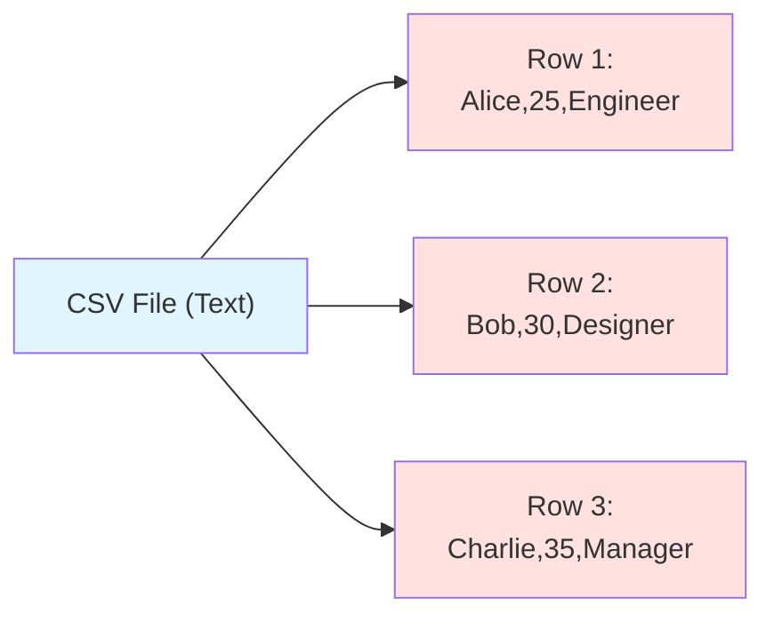
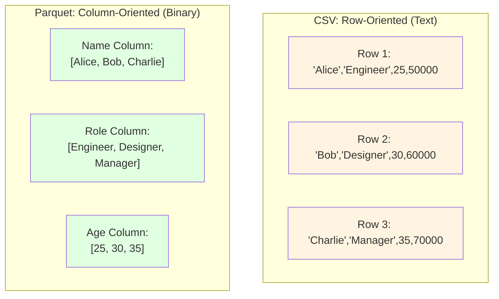
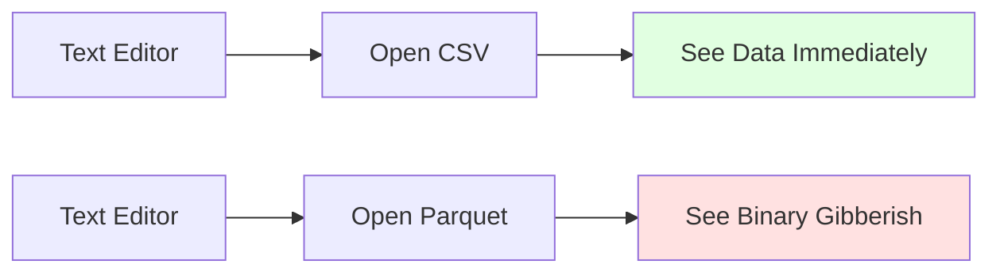
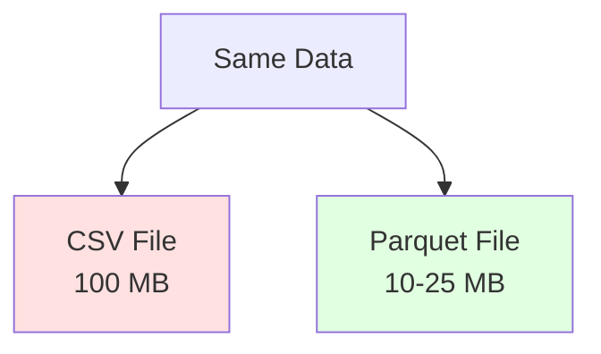
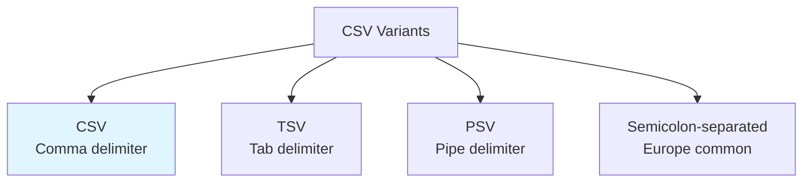
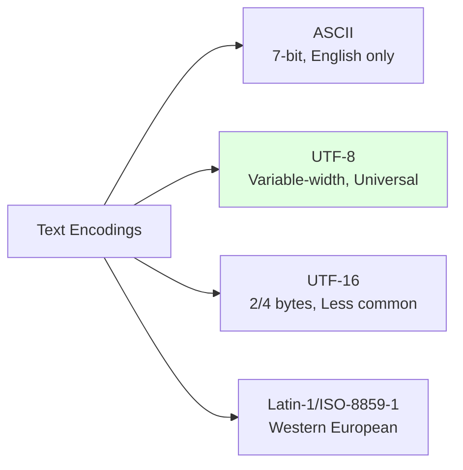
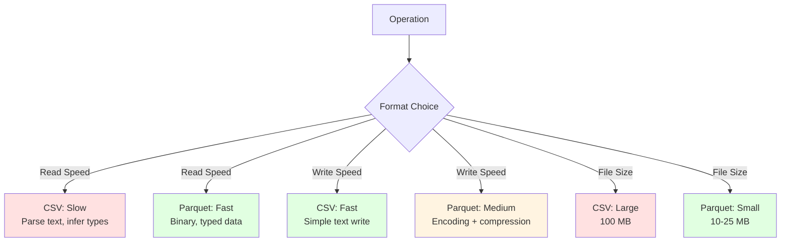
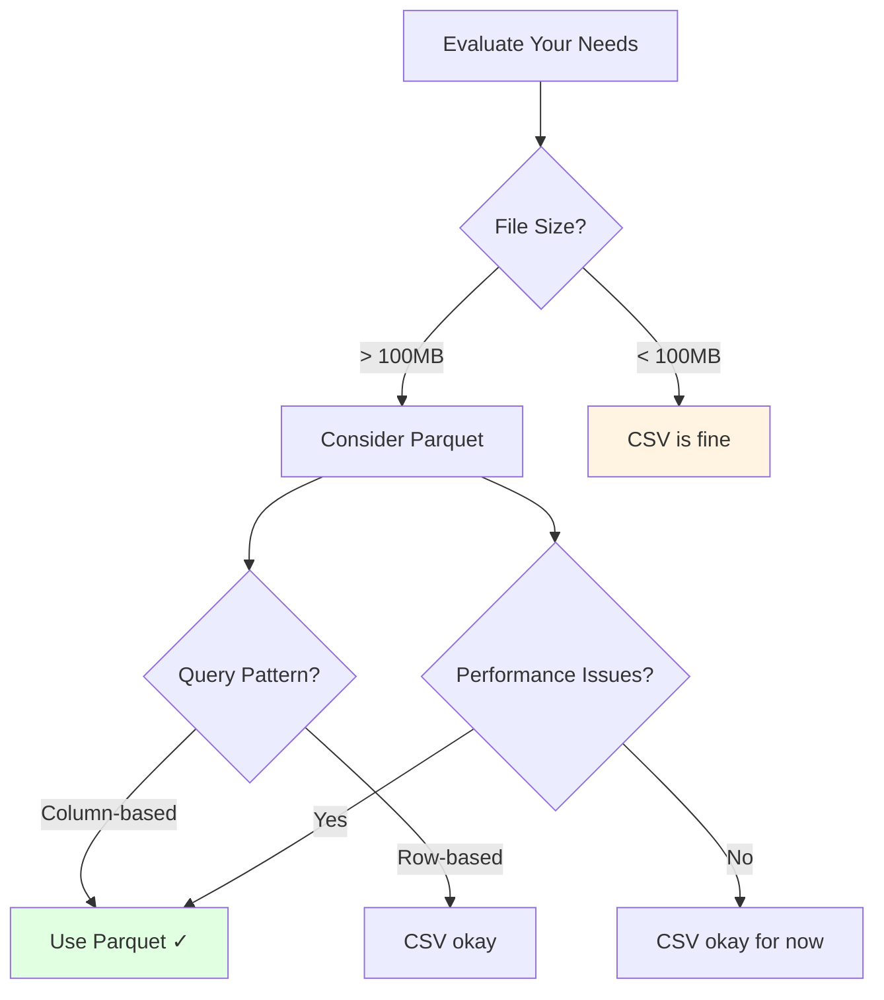

# CSV File Format

## Overview
CSV (Comma-Separated Values) is a simple, **character-based** text file format used to store tabular data. Despite its simplicity, it remains one of the most widely used data interchange formats due to its human-readable nature and universal support.

## Key Characteristics

### 1. Text-Based Format
- **Human-readable**: Can be opened with any text editor
- **Plain text**: ASCII or UTF-8 encoded characters
- **No binary encoding**: All data stored as text strings
- **Line-based**: Each row is a new line

### 2. Delimiter-Separated
- **Default delimiter**: Comma (,)
- **Variants**: TSV (tab), PSV (pipe |), semicolon (;)
- **Simple structure**: Values separated by delimiter



### 3. Row-Oriented Storage
Data stored row-by-row (vs. column-oriented like [[41.01 Parquet File Format|Parquet]]):



## File Structure

### Basic Format

```csv
name,age,role,salary
Alice,25,Engineer,50000
Bob,30,Designer,60000
Charlie,35,Manager,70000
```

### With Header Row
First row contains column names:
```csv
id,name,email,created_date
1,Alice,alice@example.com,2024-01-15
2,Bob,bob@example.com,2024-02-20
```

### Without Header
No header row (requires external schema):
```csv
1,Alice,alice@example.com,2024-01-15
2,Bob,bob@example.com,2024-02-20
```

## Handling Special Cases

### 1. Quoted Values
Use quotes to handle commas within values:
```csv
name,address,city
Alice,"123 Main St, Apt 4",Boston
Bob,"456 Oak Ave, Suite 200",Seattle
```

### 2. Escaped Quotes
Double quotes to escape quotes:
```csv
name,quote
Alice,"She said ""Hello"" to me"
Bob,"The ""best"" day ever"
```

### 3. Line Breaks
Quoted values can contain newlines:
```csv
name,description
Alice,"Multi-line
description here"
Bob,"Another
example"
```

### 4. Empty Values
Empty fields represent NULL or empty strings:
```csv
name,middle_name,last_name
Alice,,Smith
Bob,James,Johnson
Charlie,,,
```

## Advantages

### 1. Simplicity
- **Easy to create**: Any text editor
- **Easy to understand**: Visual inspection
- **No special tools**: Universal support

### 2. Human-Readable


### 3. Universal Support
- **All languages**: Python, R, Java, JavaScript, etc.
- **All tools**: Excel, Google Sheets, databases
- **All platforms**: Windows, Linux, macOS
- **No dependencies**: No special libraries needed

### 4. Small Files
- **Efficient for small data**: Low overhead
- **Fast writes**: No compression/encoding needed
- **Quick iteration**: Easy to edit manually

### 5. Version Control Friendly
- Text-based format works well with Git
- Can see diffs line-by-line
- Merge conflicts are readable

## Disadvantages

### 1. No Data Types
Everything is stored as text:
```csv
id,age,salary,is_active
1,25,50000,true
2,30,60000,false
```
- `25` stored as "25" (string)
- `true` stored as "true" (string)
- Must infer or specify types when reading

### 2. No Schema
- No embedded metadata
- Column types not defined
- Requires external documentation

### 3. Large File Size


- No compression by default
- Verbose text representation
- Numbers stored as characters

### 4. Slow Parsing
- Must parse text to extract values
- String splitting overhead
- Type conversion needed

### 5. Ambiguity Issues
```csv
# Different interpretations possible
date,value
01/02/2024,100    # Jan 2 or Feb 1?
2024-01-02,100    # Better, but still text
```

### 6. No Nested Data
- Flat structure only
- Cannot represent arrays or objects
- Must denormalize or use multiple files

## CSV Dialects and Variations

### Common Variations


### Dialect Parameters
- **Delimiter**: `,` or `\t` or `|` or `;`
- **Quote character**: `"` or `'`
- **Escape character**: `\` or double quotes
- **Line terminator**: `\n` or `\r\n`
- **Skip initial space**: Yes/No

## Working with CSV

### Python with Pandas

```python
import pandas as pd

# Write CSV
df = pd.DataFrame({
    'name': ['Alice', 'Bob', 'Charlie'],
    'age': [25, 30, 35],
    'salary': [50000, 60000, 70000]
})

df.to_csv('data.csv', index=False)

# Read CSV
df = pd.read_csv('data.csv')

# Specify data types
df = pd.read_csv('data.csv', dtype={
    'age': int,
    'salary': float
})

# Handle different delimiters
df = pd.read_csv('data.tsv', sep='\t')

# Skip rows
df = pd.read_csv('data.csv', skiprows=2)

# Parse dates
df = pd.read_csv('data.csv', parse_dates=['created_date'])

# Handle missing values
df = pd.read_csv('data.csv', na_values=['NA', 'null', ''])
```

### Python with csv Module

```python
import csv

# Write CSV
with open('data.csv', 'w', newline='') as f:
    writer = csv.writer(f)
    writer.writerow(['name', 'age', 'salary'])
    writer.writerow(['Alice', 25, 50000])
    writer.writerow(['Bob', 30, 60000])

# Read CSV
with open('data.csv', 'r') as f:
    reader = csv.reader(f)
    headers = next(reader)  # Skip header
    for row in reader:
        print(row)

# Dictionary reader
with open('data.csv', 'r') as f:
    reader = csv.DictReader(f)
    for row in reader:
        print(row['name'], row['age'])

# Custom dialect
csv.register_dialect('pipes', delimiter='|', quoting=csv.QUOTE_ALL)
with open('data.psv', 'w', newline='') as f:
    writer = csv.writer(f, dialect='pipes')
    writer.writerow(['name', 'value'])
```

### PySpark

```python
from pyspark.sql import SparkSession

spark = SparkSession.builder.getOrCreate()

# Read CSV
df = spark.read.csv('data.csv', header=True, inferSchema=True)

# Specify schema
from pyspark.sql.types import StructType, StructField, StringType, IntegerType

schema = StructType([
    StructField('name', StringType(), True),
    StructField('age', IntegerType(), True)
])

df = spark.read.csv('data.csv', header=True, schema=schema)

# Write CSV
df.write.csv('output/', header=True, mode='overwrite')
```

## Character Encoding

### Common Encodings


### Encoding Issues
```python
# Read with specific encoding
df = pd.read_csv('data.csv', encoding='utf-8')
df = pd.read_csv('data.csv', encoding='latin-1')
df = pd.read_csv('data.csv', encoding='cp1252')  # Windows

# Handle encoding errors
df = pd.read_csv('data.csv', encoding='utf-8', errors='replace')
```

### BOM (Byte Order Mark)
- UTF-8 BOM: `EF BB BF`
- Can cause parsing issues
- Some tools add it, others don't

## Best Practices

### 1. Always Include Headers
```csv
# Good
name,age,role
Alice,25,Engineer

# Bad (ambiguous)
Alice,25,Engineer
Bob,30,Designer
```

### 2. Quote String Values
```csv
# Safer
"Alice","Engineer","Boston, MA"
"Bob","Designer","Seattle, WA"
```

### 3. Use Consistent Date Formats
```csv
# Good: ISO 8601
date,value
2024-01-15,100
2024-02-20,200

# Bad: Ambiguous
date,value
01/15/2024,100
02/20/2024,200
```

### 4. Handle NULL Values Consistently
```csv
# Explicit NULL marker
name,age,salary
Alice,25,50000
Bob,,  # Empty = NULL
Charlie,35,70000
```

### 5. Validate Data
```python
# Check for issues
df = pd.read_csv('data.csv')
print(df.dtypes)  # Check inferred types
print(df.isnull().sum())  # Check NULL counts
print(df.duplicated().sum())  # Check duplicates
```

### 6. Compress for Storage
```python
# Write compressed CSV
df.to_csv('data.csv.gz', compression='gzip', index=False)

# Read compressed CSV (automatic)
df = pd.read_csv('data.csv.gz')
```

## Performance Considerations

### Reading Large CSVs

```python
# Read in chunks
chunk_size = 10000
chunks = []
for chunk in pd.read_csv('large.csv', chunksize=chunk_size):
    # Process chunk
    processed = process_chunk(chunk)
    chunks.append(processed)

df = pd.concat(chunks, ignore_index=True)

# Use specific columns only
df = pd.read_csv('large.csv', usecols=['id', 'name', 'age'])

# Use efficient dtypes
df = pd.read_csv('large.csv', dtype={
    'id': 'int32',  # Instead of int64
    'category': 'category'  # For low-cardinality strings
})
```

### CSV vs Parquet Performance



## Use Cases

### ✅ Ideal For
- **Small datasets**: < 100MB
- **Human inspection**: Need to view/edit data
- **Data exchange**: Between different systems
- **Simple tabular data**: Flat structure
- **Quick prototyping**: Fast iteration
- **Version control**: Track changes in Git
- **Excel compatibility**: Business users
- **Web downloads**: Simple distribution

### ❌ Not Ideal For
- **Large datasets**: > 1GB
- **Complex types**: Nested structures
- **Performance-critical**: High-speed analytics
- **Type safety**: Need guaranteed data types
- **Columnar queries**: Select specific columns
- **Compression ratio**: Storage-constrained
- **Schema enforcement**: Need validation

## When to Migrate from CSV to Parquet



## Common Pitfalls

### 1. Encoding Mismatches
```python
# Can cause UnicodeDecodeError
df = pd.read_csv('data.csv')  # Assumes UTF-8

# Solution: Specify encoding
df = pd.read_csv('data.csv', encoding='latin-1')
```

### 2. Type Inference Errors
```python
# Leading zeros lost
# CSV: 00123 → Pandas: 123
# Solution: Read as string
df = pd.read_csv('data.csv', dtype={'id': str})
```

### 3. Large Numbers as Scientific Notation
```python
# 123456789012345 → 1.23456789e+14 in Excel
# Solution: Quote numbers or use string type
```

### 4. Delimiter Confusion
```python
# European CSVs often use semicolon
# Solution: Auto-detect or specify
df = pd.read_csv('data.csv', sep=';')
```

## Comparison with Other Formats

| Feature | CSV | [[41.01 Parquet File Format\|Parquet]] | [[41.03 JSON File Format\|JSON]] |
|---------|-----|---------|------|
| **Format** | Text | Binary | Text |
| **Human-Readable** | ✅ Yes | ❌ No | ✅ Yes |
| **Data Types** | ❌ No | ✅ Yes | ⚠️ Limited |
| **Nested Data** | ❌ No | ✅ Yes | ✅ Yes |
| **File Size** | Large | Small | Largest |
| **Read Speed** | Slow | Fast | Slow |
| **Write Speed** | Fast | Medium | Fast |
| **Schema** | ❌ No | ✅ Embedded | ⚠️ Flexible |
| **Compression** | ⚠️ External | ✅ Built-in | ⚠️ External |
| **Use Case** | Simple, small data | Analytics, big data | APIs, configs |

## Related Concepts
- [[41.01 Parquet File Format]]
- [[41.03 JSON File Format]]
- Data Serialization (to be added)
- ETL Pipelines (to be added)

## References
- [RFC 4180: Common Format and MIME Type for CSV Files](https://tools.ietf.org/html/rfc4180)
- [Pandas CSV Documentation](https://pandas.pydata.org/docs/reference/api/pandas.read_csv.html)
- [Python csv Module](https://docs.python.org/3/library/csv.html)
