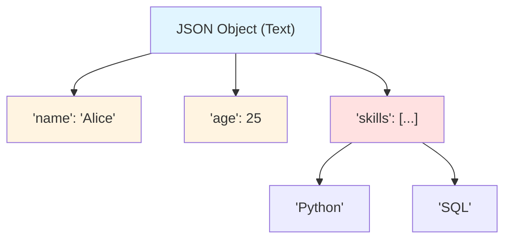
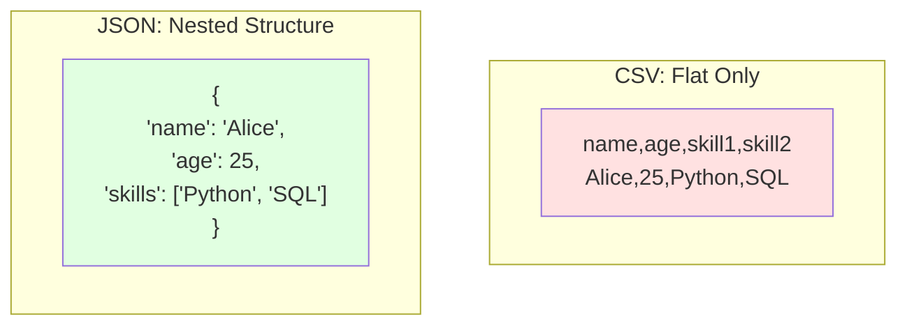
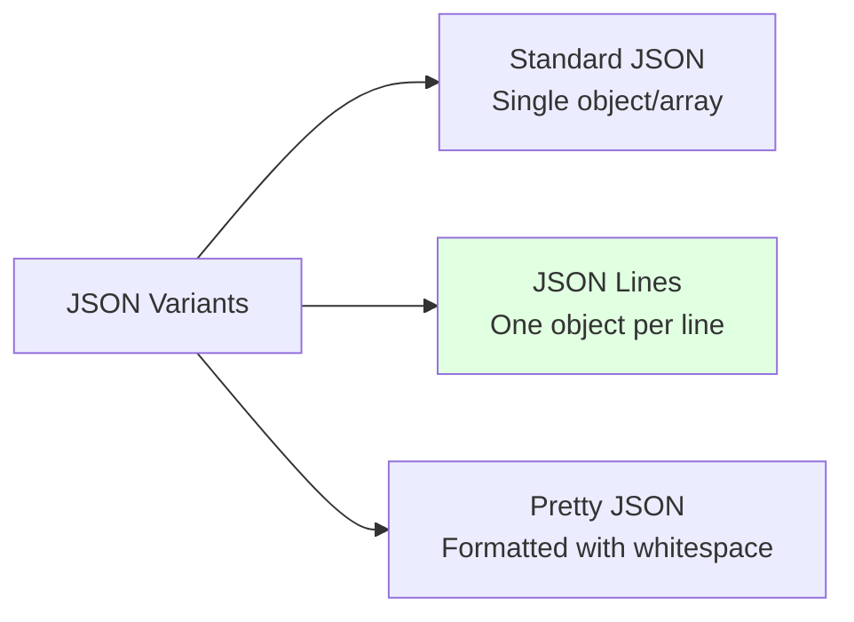
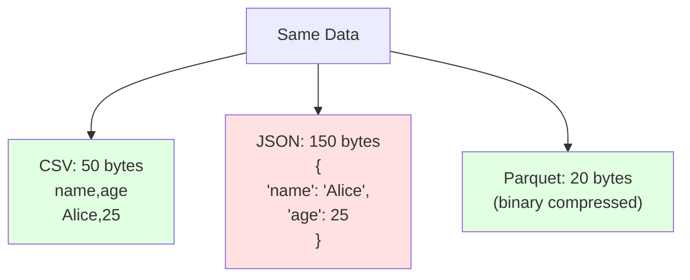
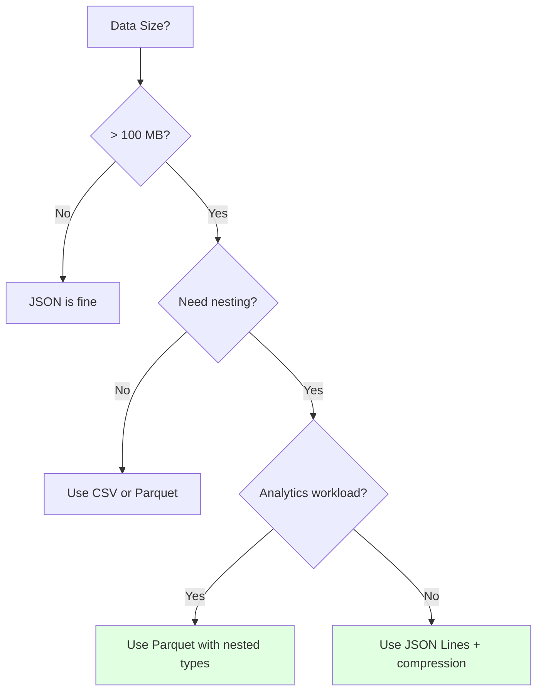
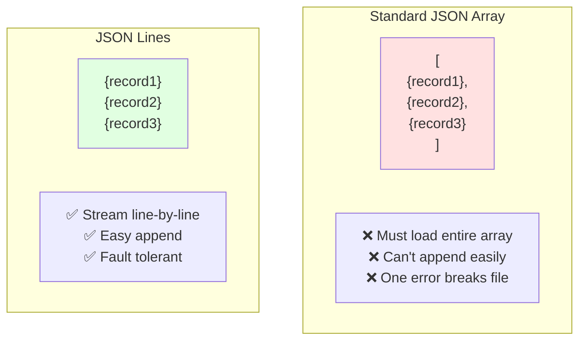

# JSON File Format

## Overview
JSON (JavaScript Object Notation) is a lightweight, **character-based** text format for data interchange. It's human-readable, language-independent, and widely used for APIs, configuration files, and semi-structured data storage.

## Key Characteristics

### 1. Text-Based Format
- **Human-readable**: Plain text, easy to inspect
- **UTF-8 encoded**: Supports Unicode characters
- **No binary encoding**: All data as text
- **Structured text**: Hierarchical organization

### 2. Self-Describing
- **Schema-less**: No predefined schema required
- **Flexible structure**: Can evolve over time
- **Key-value pairs**: Self-documenting



### 3. Hierarchical and Nested
Unlike [[41.02 CSV File Format|CSV]], JSON supports nested structures:



## Data Types

JSON supports six data types:

### 1. String
```json
{
  "name": "Alice",
  "email": "alice@example.com"
}
```

### 2. Number
```json
{
  "age": 25,
  "salary": 50000.50,
  "temperature": -15.5,
  "scientific": 1.23e10
}
```

### 3. Boolean
```json
{
  "isActive": true,
  "isDeleted": false
}
```

### 4. Null
```json
{
  "middleName": null,
  "endDate": null
}
```

### 5. Array
```json
{
  "skills": ["Python", "SQL", "Docker"],
  "numbers": [1, 2, 3, 4, 5],
  "mixed": [1, "text", true, null]
}
```

### 6. Object
```json
{
  "address": {
    "street": "123 Main St",
    "city": "Boston",
    "country": "USA"
  }
}
```

## File Structure

### Single JSON Object
```json
{
  "id": 1,
  "name": "Alice",
  "age": 25,
  "skills": ["Python", "SQL"],
  "address": {
    "city": "Boston",
    "country": "USA"
  }
}
```

### Array of Objects
```json
[
  {
    "id": 1,
    "name": "Alice",
    "age": 25
  },
  {
    "id": 2,
    "name": "Bob",
    "age": 30
  }
]
```

### JSON Lines (JSONL/NDJSON)
One JSON object per line:
```json
{"id": 1, "name": "Alice", "age": 25}
{"id": 2, "name": "Bob", "age": 30}
{"id": 3, "name": "Charlie", "age": 35}
```

**Benefits:**
- Streamable
- Append-friendly
- Can process line-by-line
- Popular for logs and events



## Advantages

### 1. Nested Data Support
```json
{
  "user": {
    "name": "Alice",
    "contacts": [
      {"type": "email", "value": "alice@example.com"},
      {"type": "phone", "value": "555-1234"}
    ],
    "preferences": {
      "theme": "dark",
      "notifications": true
    }
  }
}
```

### 2. Human-Readable
- Easy to understand structure
- Can edit manually
- Good for debugging

### 3. Language Support
Every modern programming language has JSON support:
- JavaScript (native)
- Python (json module)
- Java (Jackson, Gson)
- Go (encoding/json)
- C# (System.Text.Json)

### 4. API Standard
- RESTful APIs use JSON
- Web services standard
- Browser-native (JavaScript)

### 5. Flexible Schema
- Add/remove fields easily
- Version tolerance
- Polymorphic data

### 6. Type Information
Unlike CSV, has actual types:
```json
{
  "age": 25,          // Number, not string
  "active": true,     // Boolean, not string
  "tags": ["a", "b"]  // Array, not comma-separated string
}
```

## Disadvantages

### 1. Verbose


### 2. No Comments
Standard JSON doesn't support comments:
```json
{
  // This is NOT valid JSON
  "name": "Alice"
}
```

Workaround:
```json
{
  "_comment": "This is a workaround",
  "name": "Alice"
}
```

### 3. Duplicate Keys
Technically allowed but problematic:
```json
{
  "name": "Alice",
  "name": "Bob"  // Which one wins?
}
```

### 4. Limited Data Types
- No date/time type (use ISO 8601 strings)
- No binary data (use Base64 encoding)
- No undefined (only null)
- No NaN or Infinity (non-standard)

### 5. Large File Size
- No compression by default
- Lots of structural overhead
- Quoted keys required
- 5-10x larger than binary formats

### 6. Slow Parsing
- Text parsing overhead
- Type conversion needed
- Slower than binary formats

## Working with JSON

### Python with json Module

```python
import json

# Write JSON
data = {
    'name': 'Alice',
    'age': 25,
    'skills': ['Python', 'SQL'],
    'address': {
        'city': 'Boston',
        'country': 'USA'
    }
}

# To file
with open('data.json', 'w') as f:
    json.dump(data, f, indent=2)

# To string
json_string = json.dumps(data, indent=2)

# Read JSON
with open('data.json', 'r') as f:
    loaded_data = json.load(f)

# From string
data = json.loads(json_string)

# Handle dates
from datetime import datetime
import json

class DateTimeEncoder(json.JSONEncoder):
    def default(self, obj):
        if isinstance(obj, datetime):
            return obj.isoformat()
        return super().default(obj)

data = {'timestamp': datetime.now()}
json.dumps(data, cls=DateTimeEncoder)
```

### Python with Pandas

```python
import pandas as pd

# Write JSON (array of objects)
df = pd.DataFrame({
    'name': ['Alice', 'Bob', 'Charlie'],
    'age': [25, 30, 35]
})

df.to_json('data.json', orient='records', indent=2)
# Output: [{"name": "Alice", "age": 25}, ...]

# Different orientations
df.to_json('data.json', orient='records')  # Array of objects
df.to_json('data.json', orient='split')    # {columns: [...], data: [...]}
df.to_json('data.json', orient='index')    # {row_index: {col: val, ...}}
df.to_json('data.json', orient='columns')  # {col: {row: val, ...}}
df.to_json('data.json', orient='values')   # [[val1, val2, ...], ...]

# Read JSON
df = pd.read_json('data.json', orient='records')

# JSON Lines
df.to_json('data.jsonl', orient='records', lines=True)
df = pd.read_json('data.jsonl', orient='records', lines=True)

# Nested JSON
json_data = '''
[
  {"name": "Alice", "address": {"city": "Boston"}},
  {"name": "Bob", "address": {"city": "Seattle"}}
]
'''
df = pd.read_json(json_data)
# Flatten nested structures
from pandas import json_normalize
df = json_normalize(json.loads(json_data))
```

### PySpark

```python
from pyspark.sql import SparkSession

spark = SparkSession.builder.getOrCreate()

# Read JSON
df = spark.read.json('data.json')

# Read JSON Lines
df = spark.read.json('data.jsonl')

# With schema inference
df = spark.read.option("inferSchema", "true").json('data.json')

# Specify schema
from pyspark.sql.types import StructType, StructField, StringType, IntegerType

schema = StructType([
    StructField("name", StringType(), True),
    StructField("age", IntegerType(), True)
])

df = spark.read.schema(schema).json('data.json')

# Write JSON
df.write.json('output/', mode='overwrite')

# Write JSON Lines (more common)
df.write.mode('overwrite').json('output.jsonl')

# Handle nested data
df.select("name", "address.city").show()
```

### JavaScript (Native)

```javascript
// Parse JSON string
const jsonString = '{"name": "Alice", "age": 25}';
const data = JSON.parse(jsonString);

// Convert to JSON string
const obj = {name: "Alice", age: 25};
const jsonStr = JSON.stringify(obj);

// Pretty print
const pretty = JSON.stringify(obj, null, 2);
```

## JSON Schema

Define and validate JSON structure:

```json
{
  "$schema": "http://json-schema.org/draft-07/schema#",
  "type": "object",
  "properties": {
    "name": {"type": "string"},
    "age": {"type": "integer", "minimum": 0},
    "email": {"type": "string", "format": "email"},
    "skills": {
      "type": "array",
      "items": {"type": "string"}
    }
  },
  "required": ["name", "age"]
}
```

**Benefits:**
- Validation
- Documentation
- Code generation
- API contracts

## Best Practices

### 1. Use Consistent Naming
```json
{
  // Good: snake_case or camelCase consistently
  "first_name": "Alice",
  "last_name": "Smith",

  // Or
  "firstName": "Alice",
  "lastName": "Smith"
}
```

### 2. ISO 8601 for Dates
```json
{
  "created_at": "2024-01-15T10:30:00Z",
  "date": "2024-01-15",
  "time": "10:30:00"
}
```

### 3. Use JSON Lines for Large Datasets
```python
# Instead of one big array
# Write line by line
with open('data.jsonl', 'w') as f:
    for record in records:
        f.write(json.dumps(record) + '\n')
```

### 4. Compress Large Files
```python
import gzip
import json

# Write compressed
with gzip.open('data.json.gz', 'wt', encoding='utf-8') as f:
    json.dump(data, f)

# Read compressed
with gzip.open('data.json.gz', 'rt', encoding='utf-8') as f:
    data = json.load(f)
```

### 5. Handle Missing Values Explicitly
```json
{
  "name": "Alice",
  "middle_name": null,  // Explicit null
  "age": 25
  // Don't include optional fields if not present
}
```

### 6. Validate with Schema
```python
import jsonschema

schema = {
    "type": "object",
    "properties": {
        "name": {"type": "string"},
        "age": {"type": "integer"}
    },
    "required": ["name"]
}

data = {"name": "Alice", "age": 25}
jsonschema.validate(instance=data, schema=schema)
```

## Performance Optimization

### 1. Use JSON Lines for Streaming
```python
# Process large files without loading all into memory
def process_jsonl(filename):
    with open(filename, 'r') as f:
        for line in f:
            record = json.loads(line)
            yield record

for record in process_jsonl('large_file.jsonl'):
    process(record)
```

### 2. Use ujson for Speed
```python
import ujson  # Ultra-fast JSON encoder/decoder

# 2-3x faster than standard json
data = ujson.loads(json_string)
json_str = ujson.dumps(data)
```

### 3. Consider Alternatives for Large Data


## JSON vs JSON Lines



## Use Cases

### ✅ Ideal For
- **REST APIs**: Request/response format
- **Configuration files**: Settings, configs
- **NoSQL databases**: MongoDB, CouchDB
- **Semi-structured data**: Varying schemas
- **Nested data**: Hierarchical structures
- **Web applications**: JavaScript native
- **Message queues**: Event streaming
- **Logging**: Structured logs (JSON Lines)
- **Data exchange**: Between services

### ❌ Not Ideal For
- **Large datasets**: > 1GB
- **Tabular data**: Flat structures (use CSV)
- **Analytics**: Column-based queries (use Parquet)
- **Binary data**: Use Protocol Buffers
- **High performance**: Use binary formats
- **Storage efficiency**: High overhead

## Common Pitfalls

### 1. Trailing Commas
```json
{
  "name": "Alice",
  "age": 25,  // ❌ Trailing comma not allowed in JSON
}
```

### 2. Single Quotes
```json
{
  'name': 'Alice'  // ❌ Must use double quotes
}
```

### 3. Unquoted Keys
```json
{
  name: "Alice"  // ❌ Keys must be quoted
}
```

### 4. Special Numbers
```python
import json
import math

# These raise ValueError
json.dumps({"value": float('nan')})  # NaN not supported
json.dumps({"value": float('inf')})  # Infinity not supported

# Workaround
json.dumps({"value": float('nan')}, allow_nan=True)  # Non-standard
```

## Comparison with Other Formats

| Feature | JSON | [[41.02 CSV File Format\|CSV]] | [[41.01 Parquet File Format\|Parquet]] |
|---------|------|-----|---------|
| **Format** | Text | Text | Binary |
| **Human-Readable** | ✅ Yes | ✅ Yes | ❌ No |
| **Nested Data** | ✅ Yes | ❌ No | ✅ Yes |
| **Data Types** | ⚠️ Limited | ❌ No | ✅ Full |
| **File Size** | Largest | Large | Small |
| **Read Speed** | Slow | Slow | Fast |
| **Schema** | ⚠️ Flexible | ❌ No | ✅ Embedded |
| **API Usage** | ✅ Standard | ❌ Rare | ❌ No |
| **Compression** | ⚠️ External | ⚠️ External | ✅ Built-in |
| **Use Case** | APIs, configs | Simple tabular | Analytics |

## Related Concepts
- [[41.01 Parquet File Format]]
- [[41.02 CSV File Format]]
- [[41.04 Apache Arrow]]
- REST APIs (to be added)
- Data Serialization (to be added)
- NoSQL Databases (to be added)

## References
- [JSON.org Official Specification](https://www.json.org/)
- [RFC 8259: JSON Data Interchange Format](https://tools.ietf.org/html/rfc8259)
- [JSON Schema](https://json-schema.org/)
- [JSON Lines](https://jsonlines.org/)
- [Python json Module](https://docs.python.org/3/library/json.html)
