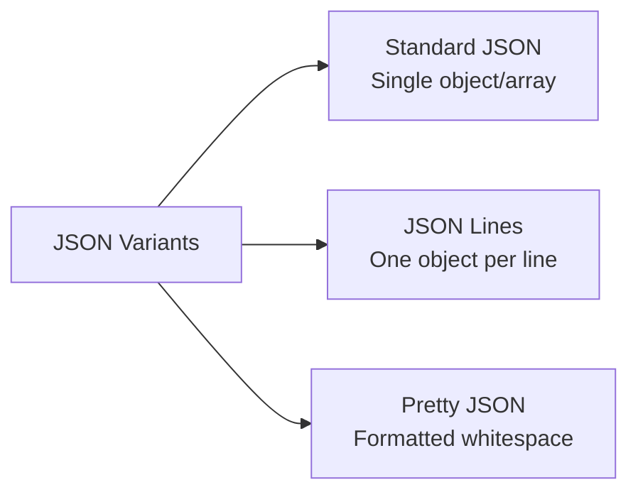
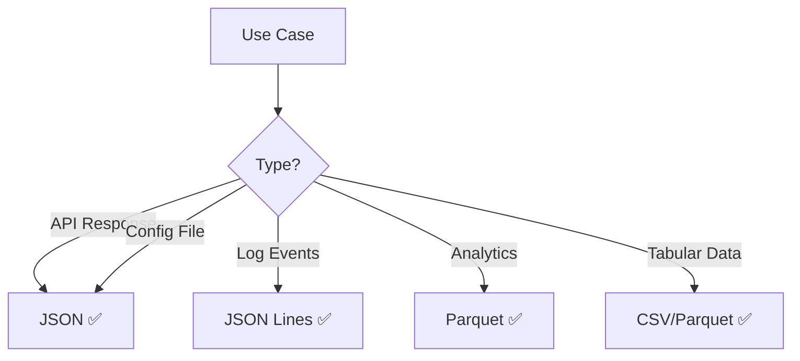

# JSON File Format

## Overview
JSON (JavaScript Object Notation) is a lightweight, **text-based** format for data interchange. Human-readable, language-independent, widely used for APIs and configuration.

## Key Characteristics

| Feature | Description |
|---------|-------------|
| **Text-based** | UTF-8 encoded, human-readable |
| **Self-describing** | Schema-less, flexible structure |
| **Hierarchical** | Supports nested objects/arrays |
| **Language-agnostic** | Native support in all languages |

## Data Types

| Type | Example |
|------|---------|
| **String** | `"name": "Alice"` |
| **Number** | `"age": 25`, `"price": 99.99` |
| **Boolean** | `"active": true` |
| **Null** | `"middleName": null` |
| **Array** | `"tags": ["a", "b", "c"]` |
| **Object** | `"address": {"city": "Boston"}` |

## File Variants



### JSON Lines (JSONL/NDJSON)
One JSON object per line—streamable, append-friendly:
```json
{"id": 1, "name": "Alice"}
{"id": 2, "name": "Bob"}
```

## Advantages vs Disadvantages

| ✅ Advantages | ❌ Disadvantages |
|---------------|------------------|
| Nested data support | Verbose (large files) |
| Human-readable | No native comments |
| Universal language support | No date/binary types |
| Flexible schema | Slow parsing (vs binary) |
| API standard | 5-10x larger than Parquet |

## Comparison with Other Formats

| Feature | JSON | [[41.02 CSV File Format\|CSV]] | [[41.01 Parquet File Format\|Parquet]] |
|---------|------|-----|---------|
| Nested data | ✅ | ❌ | ✅ |
| Human-readable | ✅ | ✅ | ❌ |
| File size | Large | Medium | Small |
| Parse speed | Slow | Medium | Fast |
| Types | 6 types | All strings | Rich types |
| Schema | Optional | Header row | Embedded |

## Best Practices

### Naming & Dates
- Use consistent naming: `snake_case` or `camelCase`
- ISO 8601 for dates: `"2024-01-15T10:30:00Z"`

### Large Datasets
- Use JSON Lines for streaming
- Compress with gzip for storage
- Consider Parquet for analytics

### Missing Values
- Use `null` explicitly for missing data
- Omit optional fields if not present

### Validation
- Use JSON Schema for contracts
- Validate before processing

## When to Use JSON



| Use Case | Recommendation |
|----------|----------------|
| REST APIs | ✅ JSON (standard) |
| Config files | ✅ JSON |
| Log streaming | ✅ JSON Lines |
| Data lake | ❌ Use Parquet |
| Spreadsheet export | ❌ Use CSV |

## Related Concepts
- [[41.01 Parquet File Format]]
- [[41.02 CSV File Format]]
- [[41.04 Apache Arrow]]

## References
- [JSON.org](https://www.json.org/)
- [JSON Schema](https://json-schema.org/)
- [JSON Lines](https://jsonlines.org/)
