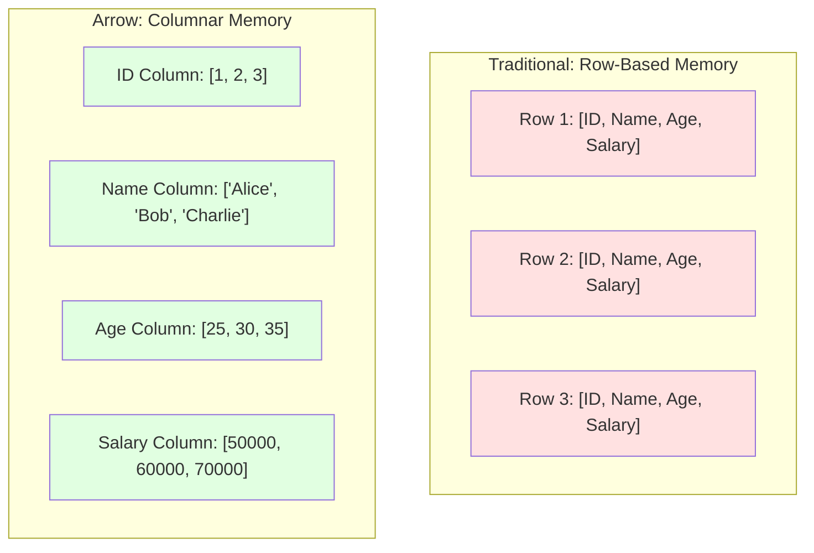
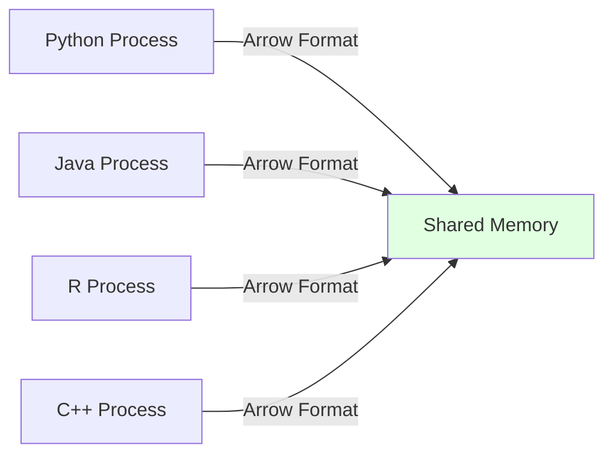
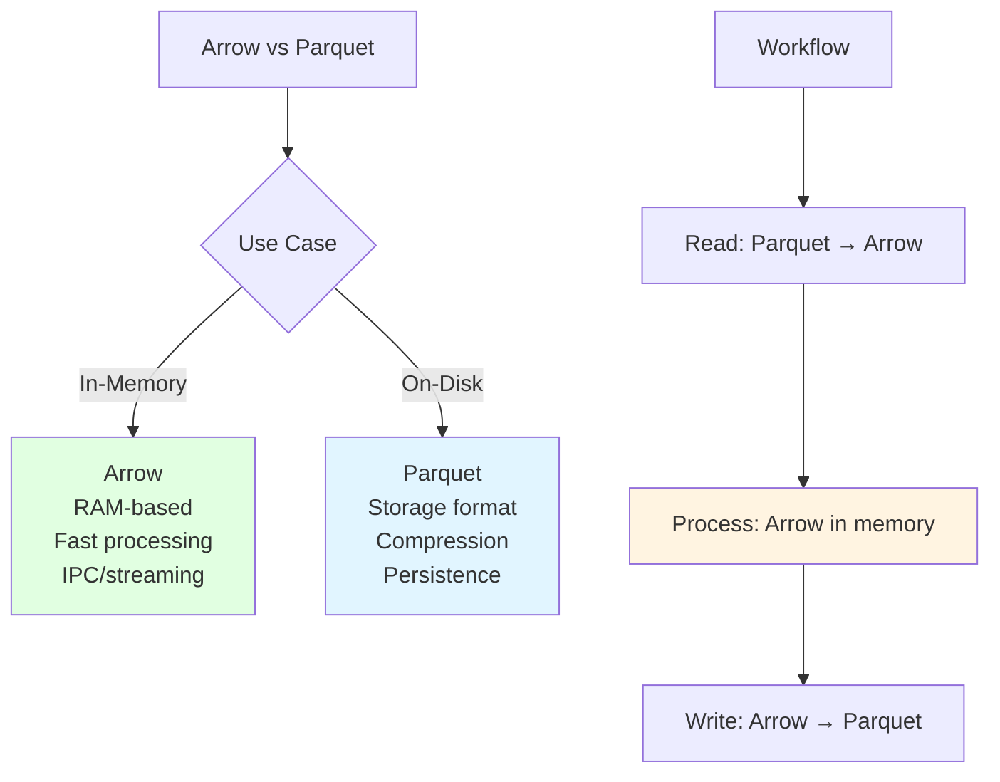
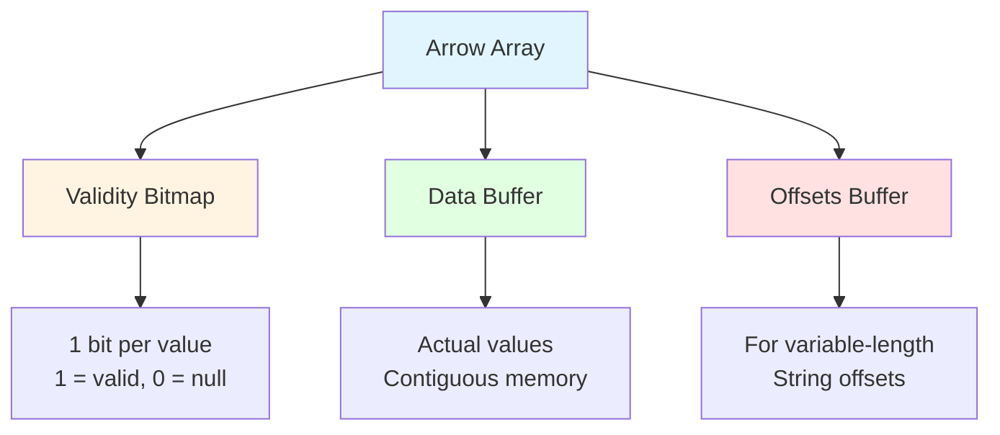
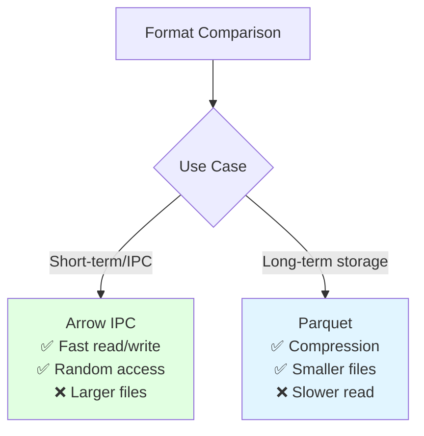
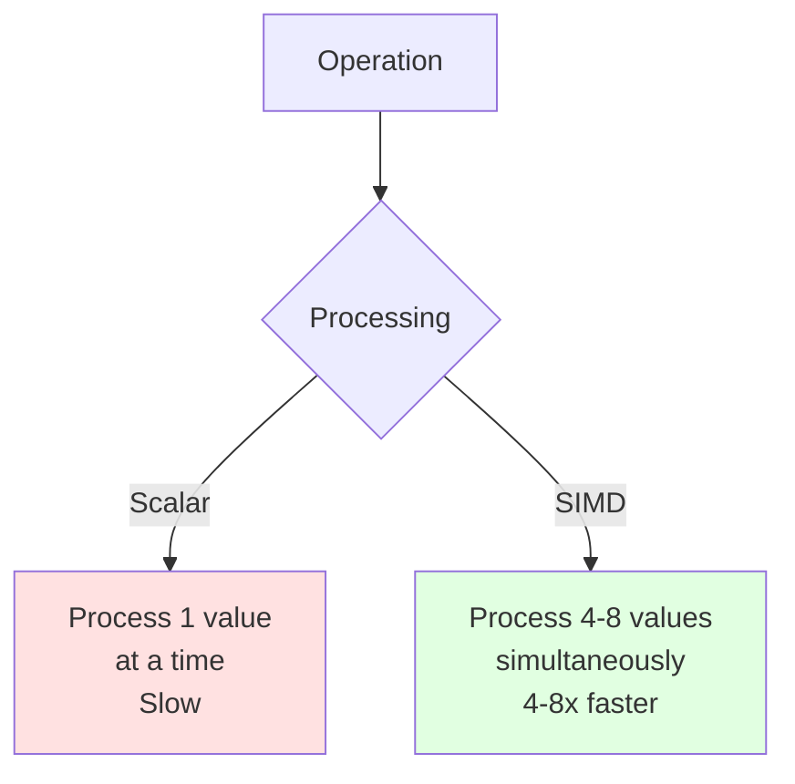
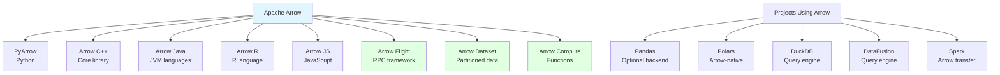

# Apache Arrow

## Overview
Apache Arrow is a cross-language, **in-memory columnar data format** and development platform designed for efficient analytics. It provides a standardized memory layout for columnar data that enables zero-copy data sharing between systems and languages, eliminating serialization overhead.

## Key Characteristics

### 1. In-Memory Columnar Format
Data stored in memory in columnar layout:
- **Column-oriented**: Similar to [[41.01 Parquet File Format|Parquet]] but in RAM
- **Cache-friendly**: SIMD-optimized operations
- **Zero-copy**: Share data without serialization



### 2. Language-Agnostic Standard
Unified memory format across languages:
- **Python**: PyArrow
- **R**: arrow package
- **Java**: Arrow Java
- **C++**: Arrow C++
- **JavaScript**: Arrow JS
- **Rust**: Arrow Rust
- **Go**: Arrow Go

### 3. Zero-Copy Data Sharing


**Without Arrow:**
```
Python → Serialize → Copy → Deserialize → Java
(Slow, memory overhead)
```

**With Arrow:**
```
Python → Arrow Buffer ← Java
(Zero-copy, instant access)
```

### 4. Optimized for Performance
- **SIMD operations**: Vectorized computations
- **Cache-efficient**: Columnar layout
- **Minimal overhead**: Direct memory access
- **Parallel processing**: Multi-threaded operations

## Arrow vs Parquet



### Key Differences

| Feature | Arrow | [[41.01 Parquet File Format\|Parquet]] |
|---------|-------|---------|
| **Purpose** | In-memory processing | On-disk storage |
| **Location** | RAM | Disk |
| **Compression** | Optional | Heavy |
| **Access Speed** | Instant | Read I/O |
| **Mutability** | Mutable | Immutable |
| **IPC** | ✅ Designed for it | ❌ Not designed |
| **Persistence** | ❌ Volatile | ✅ Persistent |
| **Use Case** | Analytics, IPC | Storage, archival |

**Complementary Relationship:**
- Parquet: Long-term storage, compressed
- Arrow: In-memory processing, fast access
- Convert between formats efficiently

## Core Components

### 1. Memory Layout



**Example: Integer Array with Nulls**
```
Values: [1, null, 3, 4, null]

Validity Bitmap: [1, 0, 1, 1, 0]
Data Buffer:     [1, ?, 3, 4, ?]
```

### 2. Type System

**Primitive Types:**
- Integer: int8, int16, int32, int64, uint8, uint16, uint32, uint64
- Float: float16, float32, float64
- Boolean: bool
- Binary: binary, large_binary
- String: utf8, large_utf8

**Temporal Types:**
- Date32, Date64
- Time32, Time64
- Timestamp (microsecond, millisecond, second, nanosecond)
- Duration
- Interval

**Nested Types:**
- List, Large List
- Struct (record/row type)
- Map
- Union (sparse, dense)
- Dictionary (categorical)

### 3. Schema
```python
import pyarrow as pa

# Define schema
schema = pa.schema([
    ('id', pa.int64()),
    ('name', pa.string()),
    ('age', pa.int32()),
    ('salary', pa.float64()),
    ('tags', pa.list_(pa.string())),
    ('metadata', pa.struct([
        ('created', pa.timestamp('ms')),
        ('updated', pa.timestamp('ms'))
    ]))
])
```

## Working with Arrow

### PyArrow Basics

```python
import pyarrow as pa
import numpy as np

# Create Arrow array
arr = pa.array([1, 2, 3, 4, 5])
print(arr.type)  # int64

# With nulls
arr_with_nulls = pa.array([1, None, 3, None, 5])

# Create Arrow table
table = pa.table({
    'id': [1, 2, 3],
    'name': ['Alice', 'Bob', 'Charlie'],
    'age': [25, 30, 35]
})

# From pandas
import pandas as pd
df = pd.DataFrame({
    'a': [1, 2, 3],
    'b': ['x', 'y', 'z']
})
arrow_table = pa.Table.from_pandas(df)

# To pandas (zero-copy when possible)
df_back = arrow_table.to_pandas()

# From NumPy
np_array = np.array([1, 2, 3, 4, 5])
arrow_array = pa.array(np_array)
```

### Reading/Writing Parquet with Arrow

```python
import pyarrow.parquet as pq

# Write Arrow table to Parquet
pq.write_table(table, 'data.parquet')

# Read Parquet to Arrow table
table = pq.read_table('data.parquet')

# Read with column selection
table = pq.read_table('data.parquet', columns=['id', 'name'])

# Read with filter
table = pq.read_table('data.parquet',
                      filters=[('age', '>', 25)])

# Batch reading for large files
parquet_file = pq.ParquetFile('large.parquet')
for batch in parquet_file.iter_batches(batch_size=10000):
    # Process batch (RecordBatch)
    process(batch)
```

### Arrow Flight: Fast Data Transport

```python
import pyarrow.flight as flight

# Server side
class FlightServer(flight.FlightServerBase):
    def do_get(self, context, ticket):
        # Return Arrow data
        table = generate_table()
        return flight.RecordBatchStream(table)

server = FlightServer()
server.serve()

# Client side
client = flight.connect('grpc://localhost:8815')
info = client.get_flight_info(flight.FlightDescriptor.for_path("dataset"))
reader = client.do_get(info.endpoints[0].ticket)
table = reader.read_all()
```

**Arrow Flight Benefits:**
- 20-100x faster than traditional RPC
- Built on gRPC
- Optimized for large datasets
- Parallel transfers

### Arrow Dataset API

```python
import pyarrow.dataset as ds

# Read partitioned Parquet dataset
dataset = ds.dataset('s3://bucket/data/',
                     format='parquet',
                     partitioning='hive')

# Query with filters and projections
table = dataset.to_table(
    columns=['name', 'age'],
    filter=ds.field('age') > 25
)

# Scan in batches
scanner = dataset.scanner(
    columns=['name', 'age'],
    filter=ds.field('age') > 25,
    batch_size=10000
)

for batch in scanner.to_batches():
    process(batch)
```

## Arrow IPC (Inter-Process Communication)

### Stream Format
Efficient for network transmission:

```python
import pyarrow as pa

# Write to stream
sink = pa.BufferOutputStream()
writer = pa.ipc.new_stream(sink, table.schema)
writer.write_table(table)
writer.close()

# Read from stream
buf = sink.getvalue()
reader = pa.ipc.open_stream(buf)
table_back = reader.read_all()
```

### File Format
For on-disk storage with random access:

```python
# Write Arrow IPC file
with pa.OSFile('data.arrow', 'wb') as f:
    with pa.ipc.new_file(f, table.schema) as writer:
        writer.write_table(table)

# Read Arrow IPC file
with pa.memory_map('data.arrow', 'r') as source:
    table = pa.ipc.open_file(source).read_all()
```

### Arrow IPC vs Parquet



## Arrow Compute Functions

Built-in vectorized operations:

```python
import pyarrow.compute as pc

# Arithmetic
arr = pa.array([1, 2, 3, 4, 5])
result = pc.multiply(arr, 2)  # [2, 4, 6, 8, 10]

# Aggregations
pc.sum(arr)  # 15
pc.mean(arr)  # 3.0
pc.min_max(arr)  # {'min': 1, 'max': 5}

# String operations
strings = pa.array(['hello', 'world', 'arrow'])
pc.utf8_upper(strings)  # ['HELLO', 'WORLD', 'ARROW']
pc.utf8_length(strings)  # [5, 5, 5]

# Filtering
mask = pc.greater(arr, 3)  # [False, False, False, True, True]
filtered = pc.filter(arr, mask)  # [4, 5]

# Sorting
pc.sort_indices(arr, sort_keys=[('values', 'descending')])

# Date/Time
timestamps = pa.array([...], type=pa.timestamp('ms'))
pc.year(timestamps)
pc.month(timestamps)
pc.day(timestamps)
```

## Integration with Data Tools

### Pandas Integration

```python
import pandas as pd
import pyarrow as pa

# Zero-copy conversion (when possible)
df = pd.DataFrame({'a': [1, 2, 3], 'b': [4, 5, 6]})
table = pa.Table.from_pandas(df, preserve_index=False)

# Arrow-backed Pandas (experimental)
df_arrow = df.astype('int64[pyarrow]')  # Arrow-backed column
```

### Polars (Arrow-native DataFrame)

```python
import polars as pl

# Polars uses Arrow internally
df = pl.DataFrame({
    'a': [1, 2, 3],
    'b': ['x', 'y', 'z']
})

# Export to Arrow
arrow_table = df.to_arrow()

# From Arrow
df_back = pl.from_arrow(arrow_table)
```

### DuckDB Integration

```python
import duckdb

# Query Arrow table directly
result = duckdb.query("SELECT * FROM table WHERE age > 25").to_arrow_table()

# Register Arrow table
duckdb.register('my_table', arrow_table)
duckdb.query("SELECT COUNT(*) FROM my_table")
```

### Spark Integration

```python
from pyspark.sql import SparkSession

spark = SparkSession.builder \
    .config("spark.sql.execution.arrow.enabled", "true") \
    .getOrCreate()

# Pandas UDF with Arrow optimization
import pandas as pd
from pyspark.sql.functions import pandas_udf

@pandas_udf("double")
def multiply_by_two(series: pd.Series) -> pd.Series:
    return series * 2  # Uses Arrow for transfer

spark_df = spark.createDataFrame(...)
result = spark_df.select(multiply_by_two("value"))
```

## Performance Benefits

### SIMD Vectorization



### Cache Efficiency

Columnar layout improves CPU cache hits:
```
Sequential column access → Better cache utilization
Random row access → Poor cache utilization
```

### Benchmark Example

```python
import time
import numpy as np
import pyarrow as pa
import pyarrow.compute as pc

# Create large array
n = 10_000_000
np_array = np.random.randint(0, 100, n)
arrow_array = pa.array(np_array)

# NumPy sum
start = time.time()
np_sum = np.sum(np_array)
np_time = time.time() - start

# Arrow sum (vectorized)
start = time.time()
arrow_sum = pc.sum(arrow_array)
arrow_time = time.time() - start

print(f"NumPy: {np_time:.4f}s")
print(f"Arrow: {arrow_time:.4f}s")  # Often 2-3x faster
```

## Use Cases

### ✅ Ideal For
- **In-memory analytics**: Fast columnar processing
- **Data interchange**: Between languages/systems
- **Query engines**: DuckDB, DataFusion
- **ETL pipelines**: High-throughput transformations
- **ML feature engineering**: Fast preprocessing
- **Streaming analytics**: Real-time processing
- **Microservices**: Arrow Flight RPC
- **Data science**: Pandas/Polars integration

### ❌ Not Ideal For
- **Long-term storage**: Use Parquet instead
- **Small datasets**: Overhead not justified
- **Row-based access**: Traditional row format better
- **Transactional workloads**: Use OLTP database

## Best Practices

### 1. Use Arrow for Processing, Parquet for Storage

```python
# Read from storage (Parquet)
table = pq.read_table('data.parquet')

# Process in memory (Arrow)
filtered = table.filter(pc.field('age') > 25)
aggregated = filtered.group_by('category').aggregate([
    ('value', 'sum'),
    ('value', 'mean')
])

# Write back to storage (Parquet)
pq.write_table(aggregated, 'result.parquet')
```

### 2. Leverage Zero-Copy When Possible

```python
# Good: Zero-copy from Arrow to Pandas
df = table.to_pandas(split_blocks=True, self_destruct=True)

# Good: Zero-copy NumPy array
arr = table['column'].to_numpy(zero_copy_only=True)
```

### 3. Use Compute Functions

```python
# Good: Vectorized Arrow compute
result = pc.multiply(table['price'], table['quantity'])

# Avoid: Row-by-row Python loops
# results = [row['price'] * row['quantity'] for row in table.to_pylist()]
```

### 4. Batch Processing for Large Data

```python
# Process in batches to control memory
for batch in parquet_file.iter_batches(batch_size=100000):
    processed = process_batch(batch)
    write_results(processed)
```

## Arrow Ecosystem



## Advanced Features

### Memory Pooling

```python
# Custom memory pool for large allocations
pool = pa.default_memory_pool()
print(f"Bytes allocated: {pool.bytes_allocated()}")
print(f"Max memory: {pool.max_memory()}")
```

### Dictionary Encoding

```python
# Efficient for low-cardinality data
categories = pa.array(['red', 'blue', 'red', 'green', 'blue'])
dict_array = categories.dictionary_encode()

# Much smaller memory footprint
print(dict_array.type)  # dictionary<values=string, indices=int32>
```

### Chunked Arrays

```python
# Handle arrays larger than 2^31 elements
chunk1 = pa.array(range(1000000))
chunk2 = pa.array(range(1000000, 2000000))
chunked = pa.chunked_array([chunk1, chunk2])
```

## Related Concepts
- [[41.01 Parquet File Format]]
- [[41.02 CSV File Format]]
- [[41.03 JSON File Format]]
- Data Lake Architecture (to be added)
- ETL Pipelines (to be added)

## References
- [Apache Arrow Official Documentation](https://arrow.apache.org/docs/)
- [PyArrow Documentation](https://arrow.apache.org/docs/python/)
- [Arrow Columnar Format Specification](https://arrow.apache.org/docs/format/Columnar.html)
- [Arrow Flight RPC](https://arrow.apache.org/docs/format/Flight.html)
- Wes McKinney (Creator) - "Apache Arrow and the Future of Data Frames"
