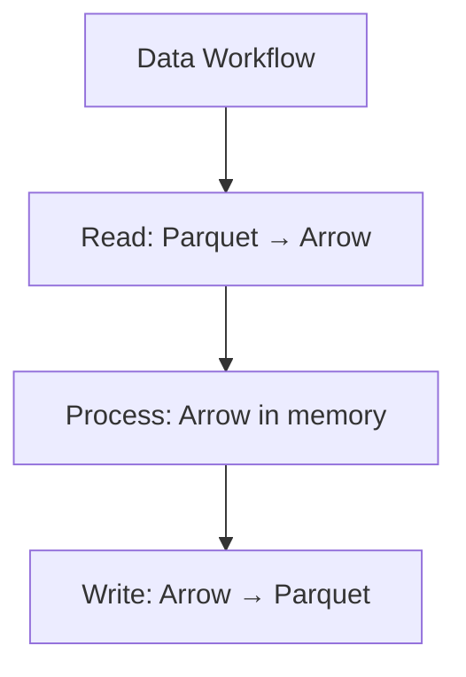
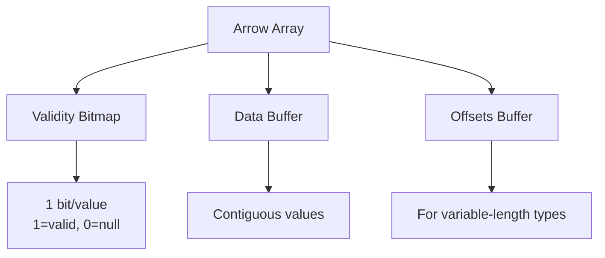
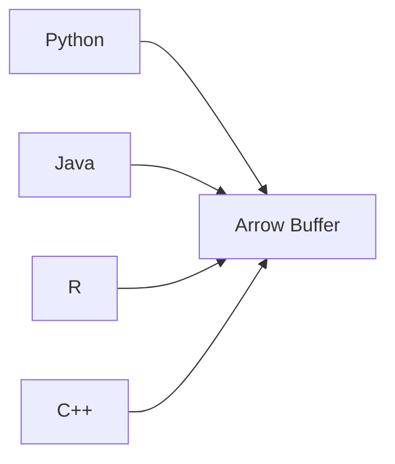

# Apache Arrow

## Overview
Apache Arrow is a cross-language **in-memory columnar data format** for efficient analytics. Provides standardized memory layout enabling zero-copy data sharing between systems and languages.

## Key Characteristics

| Feature | Description |
|---------|-------------|
| **In-memory** | RAM-based, not disk storage |
| **Columnar** | Column-oriented like Parquet |
| **Zero-copy** | Share data without serialization |
| **Language-agnostic** | Python, R, Java, C++, Rust, JS, Go |
| **SIMD-optimized** | Vectorized operations |

## Arrow vs Parquet

| Feature | Arrow | [[41.01 Parquet File Format\|Parquet]] |
|---------|-------|---------|
| **Purpose** | In-memory processing | On-disk storage |
| **Location** | RAM | Disk |
| **Compression** | Optional | Heavy |
| **IPC** | ✅ Designed for it | ❌ Not designed |
| **Persistence** | ❌ Volatile | ✅ Persistent |
| **Speed** | Instant access | I/O bound |

**Complementary**: Parquet for storage, Arrow for processing.

## Memory Layout

## Type System

### Primitive Types

| Category | Types |
|----------|-------|
| **Integer** | int8, int16, int32, int64, uint* |
| **Float** | float16, float32, float64 |
| **Boolean** | bool |
| **String** | utf8, large_utf8 |
| **Binary** | binary, large_binary |

### Temporal Types

| Type | Precision |
|------|-----------|
| Date32/Date64 | Day/millisecond |
| Time32/Time64 | Second to nanosecond |
| Timestamp | ms, μs, ns with timezone |
| Duration | Time intervals |

### Nested Types

| Type | Description |
|------|-------------|
| **List** | Variable-length array |
| **Struct** | Named fields (row type) |
| **Map** | Key-value pairs |
| **Dictionary** | Categorical (encoded) |

## Core Concepts

### Zero-Copy Sharing

Without Arrow: `Python → Serialize → Copy → Deserialize → Java` (slow)
With Arrow: `Python → Arrow Buffer ← Java` (instant)

### Arrow Flight

High-speed data transport over gRPC:
- 20-100x faster than traditional RPC
- Optimized for large datasets
- Parallel transfers

## Integration

### Ecosystem Support

| Tool | Integration |
|------|-------------|
| **Pandas** | `pa.Table.from_pandas()` |
| **Polars** | Native Arrow backend |
| **DuckDB** | Direct Arrow queries |
| **Spark** | Arrow-optimized UDFs |
| **Parquet** | Read/write via PyArrow |

### IPC Formats

| Format | Use Case |
|--------|----------|
| **Stream** | Network transmission, no random access |
| **File** | On-disk with random access |

## Performance Benefits

### Why Columnar is Fast

| Benefit | Description |
|---------|-------------|
| **SIMD** | Process 4-8 values simultaneously |
| **Cache-friendly** | Sequential memory access |
| **Vectorized ops** | Bulk operations on columns |
| **Compression** | Similar values compress well |

### Compute Functions

| Category | Examples |
|----------|----------|
| **Arithmetic** | add, multiply, divide |
| **Aggregation** | sum, mean, min, max |
| **String** | upper, lower, length |
| **Filter** | greater, equal, filter |
| **Temporal** | year, month, day |

## When to Use Arrow

| Use Case | Arrow? |
|----------|--------|
| In-memory analytics | ✅ |
| Cross-language IPC | ✅ |
| DataFrame operations | ✅ |
| Long-term storage | ❌ Use Parquet |
| Small datasets | ❌ Overhead not worth it |

## Related Concepts
- [[41.01 Parquet File Format]]
- [[41.03 JSON File Format]]
- Polars DataFrame library

## References
- [Apache Arrow](https://arrow.apache.org/)
- [PyArrow Documentation](https://arrow.apache.org/docs/python/)
