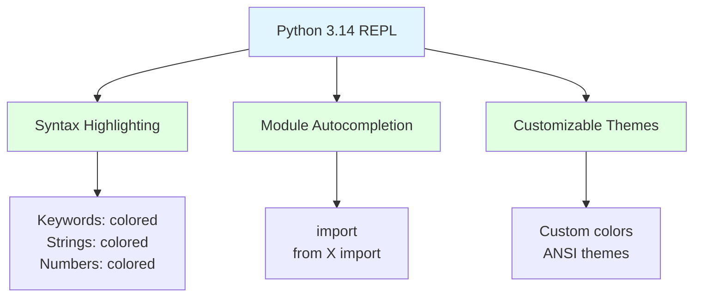
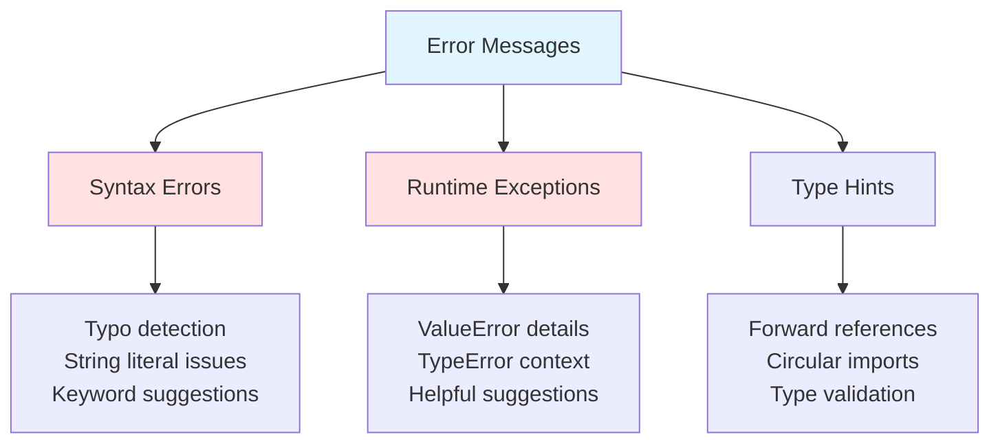
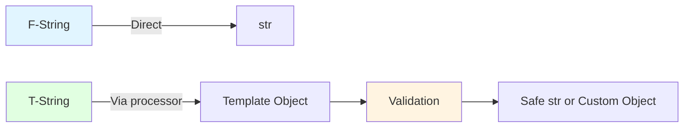
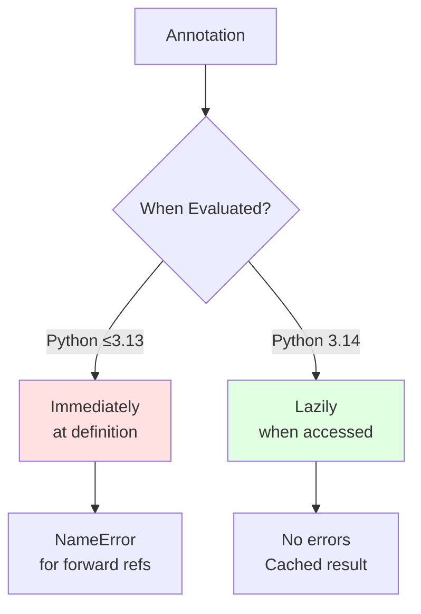
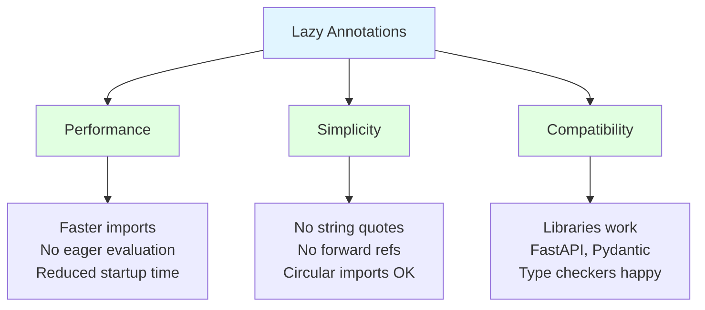
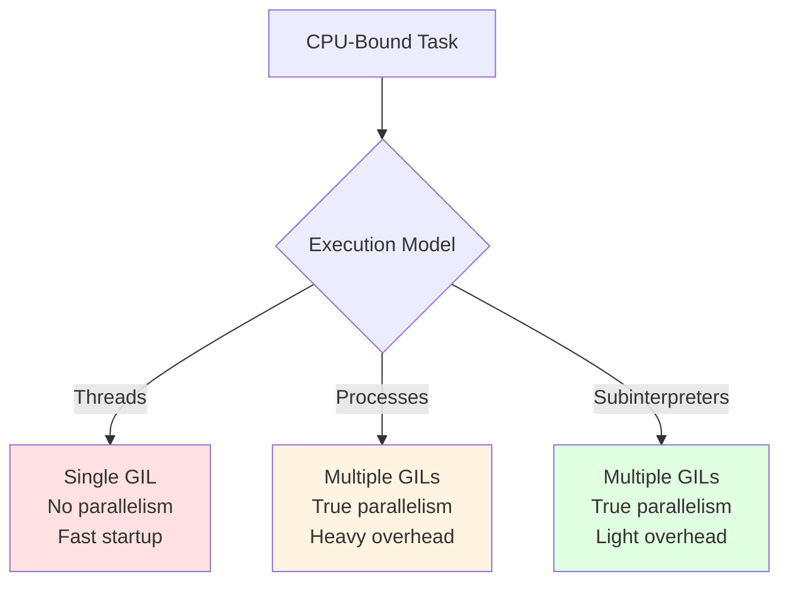
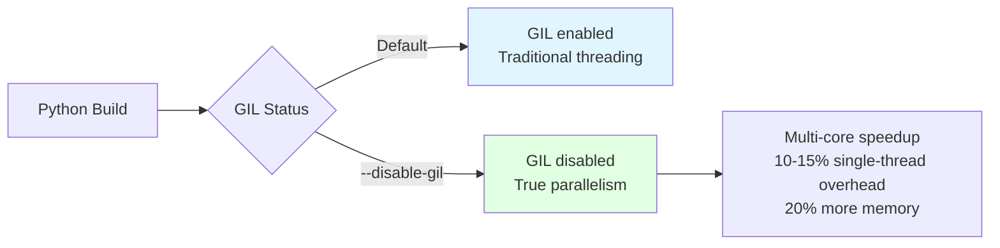
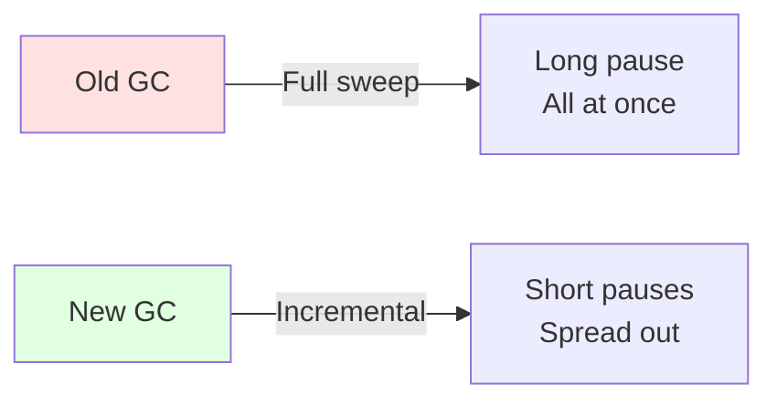
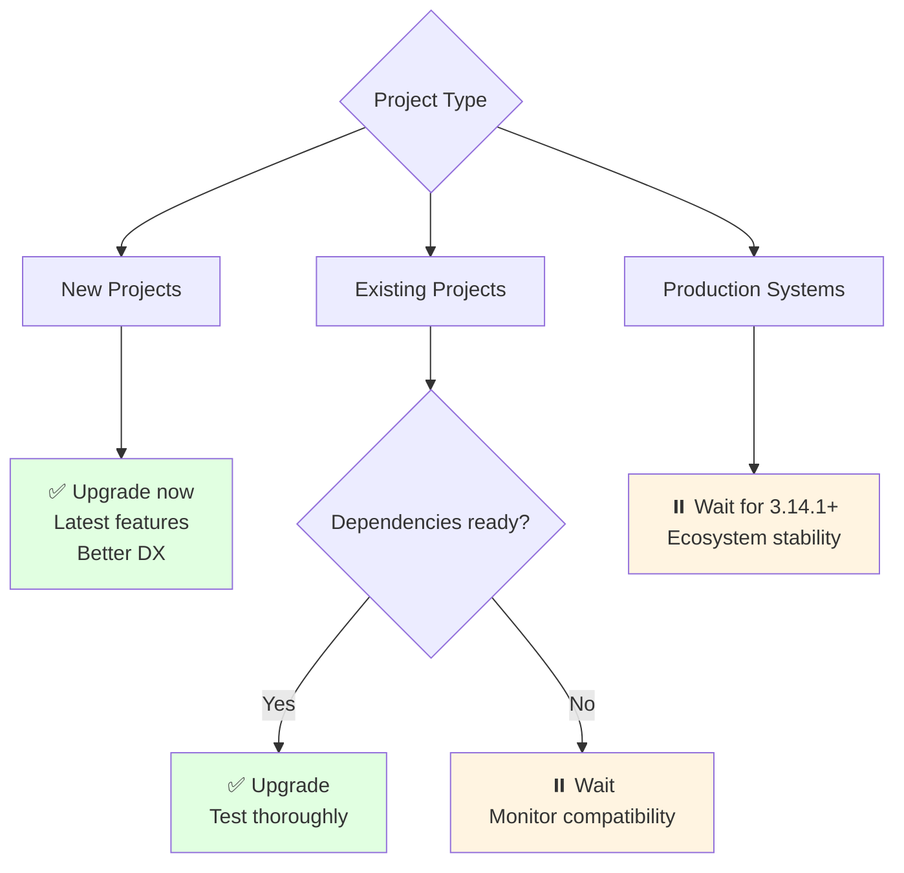

# Python 3.14 New Features

## Overview
Python 3.14 was released on **October 7, 2025**, bringing significant enhancements to developer experience, type system, performance, and new syntax. This release focuses on making Python faster, safer, and more developer-friendly while laying groundwork for future improvements.

## Release Highlights

### Major Features
- **Free-threaded Python**: Official support (no GIL)
- **Deferred evaluation of annotations**: Lazy loading for type hints
- **Template strings (t-strings)**: Safer string interpolation
- **Subinterpreters in stdlib**: Parallel execution without GIL
- **Enhanced REPL**: Syntax highlighting and autocompletion
- **Experimental JIT compiler**: Available in official binaries

## Developer Experience Improvements

### 1. Enhanced Python REPL



**Syntax Highlighting:**
```python
# Python 3.14 colors code as you type
>>> def greet(name: str) -> str:
...     return f"Hello, {name}!"
...
# Keywords, strings, and types are colored automatically
```

**Import Autocompletion:**
```python
# Press TAB after 'import' to see all modules
>>> import dat<TAB>
dataclasses  datetime  dataset

# Works with 'from ... import ...' too
>>> from collections import <TAB>
Counter  defaultdict  deque  namedtuple  OrderedDict
```

**Custom Themes:**
```python
# ~/.pythonrc.py
from _colorize import ANSIColors, default_theme, set_theme

custom_theme = default_theme.copy_with(
    syntax=default_theme.syntax.copy_with(
        keyword=ANSIColors.BOLD_CYAN,
        string=ANSIColors.GREEN,
        number=ANSIColors.YELLOW
    )
)
set_theme(custom_theme)
```

**Disable Colors:**
```bash
# Environment variables
NO_COLOR=1 python  # Disable all colors
PYTHON_COLORS=0 python  # Disable Python colors
PYTHON_BASIC_REPL=1 python  # Classic REPL
```

### 2. Better Error Messages



**Keyword Typo Detection:**
```python
>>> forr i in range(5):
  File "<stdin>", line 1
    forr i in range(5):
    ^^^^
SyntaxError: invalid syntax. Did you mean 'for'?
```

**String Literal Issues:**
```python
>>> message = "She said "Hello" to everyone"
  File "<stdin>", line 1
    message = "She said "Hello" to everyone"
                         ^^^^^
SyntaxError: invalid syntax. Is this intended to be part of the string?

>>> text = fb"Binary {text}"
  File "<stdin>", line 1
    text = fb"Binary {text}"
           ^^
SyntaxError: 'b' and 'f' prefixes are incompatible
```

**Better Runtime Exceptions:**
```python
>>> import math
>>> math.sqrt(-1)
ValueError: expected a nonnegative input, got -1.0

>>> left, right = ["apple", "banana", "orange"]
ValueError: too many values to unpack (expected 2, got 3)

>>> points = {[0, 0]: "origin"}
TypeError: cannot use 'list' as a dict key (unhashable type: 'list')
```

### 3. Safe Live Process Debugging

**PEP 768**: External debugger interface for attaching to running processes.

```python
# web_server.py
import os
import sys
from http.server import BaseHTTPRequestHandler, HTTPServer

class Handler(BaseHTTPRequestHandler):
    def do_GET(self):
        user_agent = self.headers.get("User-Agent")
        self.send_response(200)
        self.end_headers()
        self.wfile.write(f"Hello, {user_agent}".encode())

def main():
    print(f"Starting server on http://localhost:8000")
    print(f"Attach debugger: {sys.executable} -m pdb -p {os.getpid()}")
    HTTPServer(("localhost", 8000), Handler).serve_forever()

if __name__ == "__main__":
    main()
```

**Attach to Running Process:**
```bash
# Terminal 1: Start server
$ python3.14 web_server.py
Starting server on http://localhost:8000
Attach debugger: /usr/bin/python3.14 -m pdb -p 12345

# Terminal 2: Attach debugger (requires sudo)
$ sudo python3.14 -m pdb -p 12345
> /usr/lib/python3.14/selectors.py(398)select()
-> fd_event_list = self._selector.poll(timeout)
(Pdb) break web_server:11
Breakpoint 1 at web_server.py:11
(Pdb) continue
```

## New Python Syntax

### 1. Template Strings (T-Strings)

**PEP 750**: Safe string interpolation with validation layer.



**Basic Syntax:**
```python
# F-string (immediate evaluation)
>>> f"Hello, {name}"
'Hello, Alice'

# T-string (returns Template object)
>>> t"Hello, {name}"
Template(
    strings=('Hello, ', ''),
    interpolations=(
        Interpolation('Alice', 'name', None, ''),
    )
)
```

**SQL Injection Prevention:**
```python
from string.templatelib import Template
from dataclasses import dataclass
from typing import Any

@dataclass(frozen=True)
class SQLQuery:
    statement: str
    params: list[Any]

    def __init__(self, template: Template) -> None:
        items, params = [], []
        for item in template:
            if isinstance(item, str):
                items.append(item)
            else:
                params.append(item.value)
                items.append("?")  # Parameterized placeholder
        super().__setattr__("statement", "".join(items))
        super().__setattr__("params", params)

def find_users(name: str) -> SQLQuery:
    return SQLQuery(t"SELECT * FROM users WHERE name = {name}")

# Safe: Uses parameterized queries
>>> query = find_users("' OR '1'='1")
>>> query.statement
'SELECT * FROM users WHERE name = ?'
>>> query.params
["' OR '1'='1"]
```

**Custom Template Processors:**
```python
def render_html(template: Template) -> str:
    """Escape HTML in interpolations."""
    import html
    items = []
    for item in template:
        if isinstance(item, str):
            items.append(item)
        else:
            escaped = html.escape(str(item.value))
            items.append(escaped)
    return "".join(items)

user_input = "<script>alert('XSS')</script>"
html_output = render_html(t"<div>{user_input}</div>")
# "<div>&lt;script&gt;alert('XSS')&lt;/script&gt;</div>"
```

### 2. Exceptions Without Parentheses

**PEP 758**: Optional parentheses for multiple exceptions.

```python
# Python 3.13 (parentheses required)
try:
    int("invalid")
except (ValueError, TypeError):
    print("Error occurred")

# Python 3.14 (parentheses optional)
try:
    int("invalid")
except ValueError, TypeError:
    print("Error occurred")

# Still required with 'as' keyword
try:
    int("invalid")
except (ValueError, TypeError) as e:
    print(f"Error: {e}")

# Works with exception groups
try:
    raise ExceptionGroup("errors", [ValueError(), TypeError()])
except* ValueError, TypeError:
    print("Handling exception group")
```

### 3. Warnings in `try...finally` Blocks

**PEP 765**: Warn about control flow in `finally`.

```python
# Python 3.14 issues SyntaxWarning
>>> def risky_operation():
...     try:
...         raise ValueError("Something went wrong!")
...     finally:
...         return "Suppressed"  # ⚠️ SyntaxWarning
...
<stdin>:5: SyntaxWarning: 'return' in a 'finally' block

# Better approach
>>> def safer_function():
...     result = None
...     try:
...         result = "Success"
...         raise ValueError("Error")
...     finally:
...         print("Cleanup")
...     return result
```

**Warning applies to:**
- `return` statements
- `break` statements
- `continue` statements

## Type Checking Revolution

### 1. Deferred Evaluation of Annotations

**PEP 649**: Annotations evaluated lazily, not at definition time.



**Forward References (No Longer an Issue):**
```python
# Python 3.14 (works without quotes!)
from dataclasses import dataclass
from typing import Optional

@dataclass
class LinkedList:
    head: Node  # Forward reference works!

@dataclass
class Node:
    value: int
    next: Optional[Node] = None  # Self-reference works!
```

**Deferred Evaluation Example:**
```python
>>> def function() -> 1 / 0:  # Would raise ZeroDivisionError
...     print("Function runs fine")
...
>>> function()
Function runs fine

>>> function.__annotations__  # Now it evaluates
ZeroDivisionError: division by zero
```

**Accessing Annotations:**
```python
from annotationlib import Format, get_annotations
from typing import get_type_hints

# Three formats available
>>> get_annotations(LinkedList, format=Format.STRING)
{'head': 'Node'}

>>> get_annotations(LinkedList, format=Format.FORWARDREF)
{'head': ForwardRef('Node', is_class=True, owner=<class 'LinkedList'>)}

>>> get_annotations(LinkedList, format=Format.VALUE)
{'head': <class 'Node'>}

# For type hints
>>> get_type_hints(function)
{'return': <class 'int'>}
```

**Caching Behavior:**
```python
def fib(n):
    return n if n < 2 else fib(n - 2) + fib(n - 1)

def annotated_func() -> fib(5):
    pass

# First access: computes fib(5) with all recursive calls
>>> annotated_func.__annotations__
{'return': 5}

# Subsequent accesses: cached result
>>> annotated_func.__annotations__
{'return': 5}  # No computation
```

### 2. Benefits of Lazy Annotations



## Performance Optimizations

### 1. Parallel Subinterpreters

**PEP 734**: Multiple interpreters in stdlib for true parallelism.



**InterpreterPoolExecutor:**
```python
from concurrent.futures import (
    InterpreterPoolExecutor,
    ProcessPoolExecutor,
    ThreadPoolExecutor,
)
from time import perf_counter

def fib(n):
    return n if n < 2 else fib(n - 2) + fib(n - 1)

def benchmark(Pool, max_value=35, num_tasks=4):
    t1 = perf_counter()
    with Pool(max_workers=4) as pool:
        list(pool.map(fib, [max_value] * num_tasks))
    t2 = perf_counter()
    print(f"{Pool.__name__}: {(t2 - t1):.2f}s")

# Compare execution times
benchmark(InterpreterPoolExecutor)  # ~10s (parallel)
benchmark(ProcessPoolExecutor)      # ~10s (parallel, more overhead)
benchmark(ThreadPoolExecutor)       # ~40s (sequential due to GIL)
```

**Key Characteristics:**
- Each interpreter has its own GIL
- True parallelism on multiple cores
- Lighter than processes (faster startup, less memory)
- Arguments/results must be pickleable
- No shared live objects between interpreters

### 2. Free-Threaded Python

**PEP 779**: Officially supported GIL-free build.



**Build Free-Threaded Python:**
```bash
# Compile from source
$ ./configure --disable-gil
$ make
$ make install

# Or use pyenv
$ pyenv install 3.14.0-freethreaded
```

**Runtime GIL Control:**
```python
import sys

# Check GIL status
if hasattr(sys, '_is_gil_enabled'):
    print(f"GIL enabled: {sys._is_gil_enabled()}")
```

**Performance Trade-offs:**

| Aspect | With GIL | Without GIL |
|--------|----------|-------------|
| Single-thread speed | Baseline | 10-15% slower |
| Multi-thread CPU-bound | Single core | All cores |
| Memory usage | Baseline | ~20% more |
| Extension compatibility | High | Requires updates |
| ABI | Standard | Separate |

**Use Cases:**
- ✅ CPU-intensive parallel workloads
- ✅ Data processing pipelines
- ✅ Numerical simulations
- ❌ Single-threaded scripts
- ❌ I/O-bound tasks (threads already work)

### 3. Experimental JIT Compiler

**Available in official binaries** (Windows, macOS).

```python
# Check JIT availability
try:
    from sys import _jit
    print(f"JIT available: {_jit.is_available()}")
    print(f"JIT enabled: {_jit.is_enabled()}")
    print(f"JIT active: {_jit.is_active()}")
except ImportError:
    print("JIT not compiled in")
```

**Enable JIT:**
```bash
# Environment variable
$ PYTHON_JIT=1 python3.14 script.py

# Build from source (Linux)
$ export PYTHON_CONFIGURE_OPTS='--enable-experimental-jit'
$ pyenv install 3.14.0
```

**Current Status:**
- ⚠️ **Experimental** (not production-ready)
- May slow down some workloads
- Included for exploration and testing
- Active development for future releases

### 4. Tail-Calling Interpreter

**Internal performance improvement** (requires specific build).

```bash
# Build with tail-call interpreter
$ ./configure --with-tail-call-interp
$ make
```

**Benefits:**
- 3-5% performance improvement (realistic)
- Reduced dispatch overhead
- Requires Clang 19+ on x86-64/AArch64
- **Does NOT provide tail-call optimization for Python code**

**Not Affected:**
```python
# Still hits recursion limit
def factorial(n):
    return 1 if n <= 1 else n * factorial(n - 1)

factorial(10000)  # RecursionError (same as before)
```

### 5. Incremental Garbage Collector

**Spreads GC work across multiple steps** to reduce pauses.



**Benefits:**
- Shorter, less noticeable pauses
- Better for latency-sensitive apps (servers, games, UIs)
- Automatic (no code changes needed)
- Successfully re-introduced after Python 3.13 rollback

## Ecosystem Changes

### 1. Standard Library Additions

**Zstandard Compression (PEP 784):**
```python
import compression.zstd as zstd

# Compress data
data = b"Hello, world!" * 1000
compressed = zstd.compress(data, level=3)

# Decompress
decompressed = zstd.decompress(compressed)
```

**UUID Versions 6-8:**
```python
import uuid

# Time-based UUIDs with improved sorting
uuid6 = uuid.uuid6()  # Timestamp-ordered
uuid7 = uuid.uuid7()  # Unix Epoch-based
uuid8 = uuid.uuid8()  # Custom format

# 40% faster generation for UUIDs 3-5
```

**Color Support in Standard Modules:**
```python
# unittest: Colorful assertion output
# argparse: Colorful help messages
# json: Colorized JSON output
# calendar: Highlighted current day
```

### 2. Build and Distribution

**PEP 761**: Sigstore replaces PGP signatures.

```bash
# Verify release with Sigstore (instead of GPG)
$ sigstore verify --cert Python-3.14.0.tar.xz.crt \
                  --signature Python-3.14.0.tar.xz.sig \
                  Python-3.14.0.tar.xz
```

**Official Android Builds:**
- Pre-built binaries for Android (aarch64, x86_64)
- Available for download

**Windows Install Manager:**
- New Microsoft Store installer
- Replaces traditional `.exe` installer (still available in 3.14/3.15)

## Migration Considerations

### Should You Upgrade?



**Upgrade Now If:**
- Starting new projects
- Need better REPL/error messages
- Experimenting with concurrency
- Want latest type system improvements

**Wait If:**
- Production environment with strict stability requirements
- Dependencies don't support 3.14 yet
- Using C extensions heavily
- Corporate/legacy systems

### Breaking Changes

**Removals:**
- Various deprecated APIs (see official docs)
- Some C API functions

**Deprecations:**
- `from __future__ import annotations` (superseded by PEP 649)
- Older annotation introspection patterns

**Incompatibilities:**
- Free-threaded build uses separate ABI
- Some C extensions need recompilation
- Libraries may need updates for new features

## Comparison with Previous Versions

| Feature | Python 3.13 | Python 3.14 |
|---------|-------------|-------------|
| **REPL** | Multiline editing | + Syntax highlighting, import completion |
| **GIL** | Experimental free-threading | Official support |
| **Annotations** | Eager evaluation | Deferred evaluation (PEP 649) |
| **T-Strings** | ❌ | ✅ (PEP 750) |
| **Subinterpreters** | C API only | Python stdlib (PEP 734) |
| **JIT** | Experimental | Included in official binaries |
| **Error Messages** | Improved | Even better |
| **Debugger** | Standard pdb | + Live process attach (PEP 768) |
| **GC** | Standard | Incremental |

## Best Practices

### 1. Use New REPL Features
```python
# Enable custom theme in ~/.pythonrc.py
# Leverage import autocompletion for exploration
# Use syntax highlighting for debugging
```

### 2. Adopt T-Strings for Safety
```python
# Use t-strings for SQL, HTML, shell commands
# Write custom processors for your use case
# Validate/sanitize user input before interpolation
```

### 3. Leverage Lazy Annotations
```python
# Remove 'from __future__ import annotations'
# Remove quotes from forward references
# Use get_annotations() instead of .__annotations__
```

### 4. Experiment with Parallelism
```python
# Try InterpreterPoolExecutor for CPU-bound tasks
# Test free-threaded build for data processing
# Compare performance with processes/threads
```

### 5. Stay Informed on JIT
```python
# Monitor JIT development for future releases
# Test with PYTHON_JIT=1 in non-production
# Watch for performance improvements
```

## Related Concepts
- [[71_Python_Snippets_MOC]]
- [[11.03 LLM Tool Calls]] (similar to t-string processors)
- Python Version Management (to be added)
- Type System Evolution (to be added)
- Concurrency Patterns (to be added)
- Performance Profiling (to be added)

## References
- [Python 3.14 Official Release](https://www.python.org/downloads/release/python-3140/)
- [What's New in Python 3.14](https://docs.python.org/3.14/whatsnew/3.14.html)
- [Real Python: Python 3.14 New Features](https://realpython.com/python314-new-features/)
- [PEP 649: Deferred Evaluation of Annotations](https://peps.python.org/pep-0649/)
- [PEP 750: Template String Literals](https://peps.python.org/pep-0750/)
- [PEP 779: Free-Threaded Python](https://peps.python.org/pep-0779/)
- [PEP 734: Multiple Interpreters in Stdlib](https://peps.python.org/pep-0734/)
