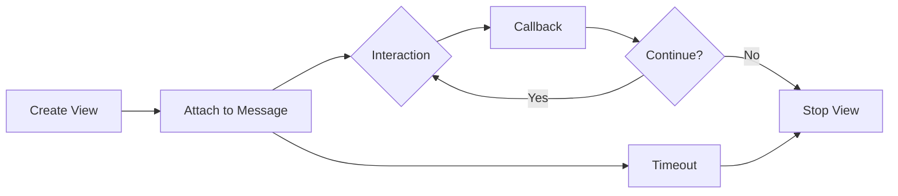

# Disnake - Discord API Wrapper

## Overview
**Disnake** is a modern Python API wrapper for Discord, forked from discord.py. Supports slash commands, buttons, select menus, modals, and maintains backward compatibility.

## Installation

```bash
pip install disnake              # Basic
pip install disnake[voice,speed] # Full
```

## Core Concepts

### Bot Setup

| Component | Purpose |
|-----------|---------|
| `commands.Bot` | Main bot class with command prefix |
| `Intents` | Permissions for events/data access |
| `on_ready` | Bot initialization event |

### Privileged Intents

| Intent | Purpose | Requires Portal |
|--------|---------|-----------------|
| `message_content` | Read message text | ✅ |
| `members` | Access member info | ✅ |
| `presences` | Presence updates | ✅ |

## Slash Commands

### Parameter Types

| Type | Description |
|------|-------------|
| `str` | Text input |
| `int` | Integer input |
| `float` | Decimal input |
| `bool` | True/False |
| `disnake.Member` | Server member picker |
| `disnake.TextChannel` | Channel picker |
| `disnake.Role` | Role picker |

### Command Features

| Feature | Use Case |
|---------|----------|
| `commands.Param()` | Add description, constraints |
| `choices=[]` | Predefined options |
| `autocomplete` | Dynamic suggestions |
| `sub_command` | Nested commands |

## Message Components

### Button Styles

| Style | Color | Use Case |
|-------|-------|----------|
| `primary` | Blue | Main action |
| `secondary` | Gray | Secondary action |
| `success` | Green | Confirm/approve |
| `danger` | Red | Delete/deny |
| `link` | Gray + arrow | External URL |

### Component Types

| Component | Purpose |
|-----------|---------|
| **Button** | Single action trigger |
| **Select Menu** | Dropdown selection |
| **Modal** | Form with text inputs |
| **View** | Container for components |

### View Lifecycle



## Embeds

### Embed Structure

| Field | Purpose |
|-------|---------|
| `title` | Header text |
| `description` | Main content |
| `color` | Side stripe color |
| `fields` | Key-value pairs |
| `thumbnail` | Small image (right) |
| `image` | Large image (bottom) |
| `footer` | Bottom text + icon |
| `author` | Top text + icon |
| `timestamp` | Shows date/time |

## Events

### Common Events

| Event | Trigger |
|-------|---------|
| `on_ready` | Bot connected |
| `on_message` | Message sent |
| `on_member_join` | User joins server |
| `on_member_remove` | User leaves server |
| `on_raw_reaction_add` | Reaction added |
| `on_button_click` | Button pressed |
| `on_slash_command_error` | Command error |

## Cogs (Extensions)

### Structure

| Component | Purpose |
|-----------|---------|
| `commands.Cog` | Base class for cog |
| `@commands.slash_command` | Slash command in cog |
| `@commands.Cog.listener()` | Event listener in cog |
| `setup(bot)` | Entry point for loading |
| `bot.load_extension()` | Load cog dynamically |

## Advanced Features

### Cooldowns

| Bucket Type | Scope |
|-------------|-------|
| `BucketType.user` | Per user |
| `BucketType.guild` | Per server |
| `BucketType.channel` | Per channel |
| `BucketType.member` | Per user per server |
| `BucketType.default` | Global |

### Context Menus

| Type | Trigger |
|------|---------|
| `@bot.user_command` | Right-click user → Apps |
| `@bot.message_command` | Right-click message → Apps |

### Tasks (Background Loops)

| Decorator | Purpose |
|-----------|---------|
| `@tasks.loop(hours=24)` | Repeat every 24 hours |
| `@task.before_loop` | Run before first iteration |
| `task.start()` | Start the loop |
| `task.stop()` | Stop the loop |

## Best Practices

### Response Types

| Method | Visibility | Use Case |
|--------|------------|----------|
| `send_message()` | Public | Normal response |
| `send_message(ephemeral=True)` | Private | Sensitive info |
| `defer()` | N/A | Long operations (>3s) |
| `followup.send()` | After defer | Actual response |

### Permission Checks

| Decorator | Check |
|-----------|-------|
| `@commands.has_permissions()` | User has permission |
| `@commands.bot_has_permissions()` | Bot has permission |
| `@commands.has_role()` | User has specific role |
| `@commands.is_owner()` | Bot owner only |

### Error Handling

| Error | Cause |
|-------|-------|
| `MissingPermissions` | User lacks permission |
| `CommandOnCooldown` | Rate limited |
| `MemberNotFound` | Invalid member |
| `BadArgument` | Invalid parameter |

## Related Concepts
- Discord Developer Portal
- Async/await in Python
- REST APIs

## References
- [Disnake Documentation](https://docs.disnake.dev/)
- [Discord API Docs](https://discord.com/developers/docs)
