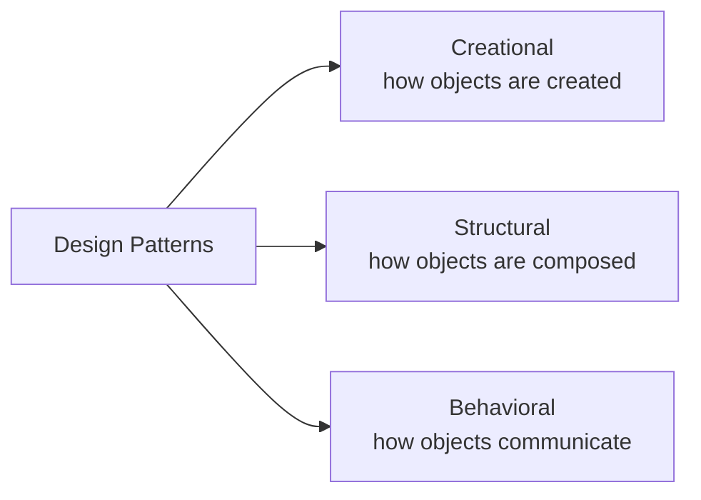

# Design Patterns

## Overview
**Design patterns** are reusable, named solutions to recurring problems in object-oriented software design. They are not code to copy but *templates for structuring relationships between classes and objects*. The canonical catalog comes from the **Gang of Four (GoF)** book — *Design Patterns: Elements of Reusable Object-Oriented Software* (1994) — which defines 23 patterns in three families.

> [!INFO] Why "named" matters
> The biggest value of patterns is **shared vocabulary**: saying "use an Adapter here" communicates an entire design in two words, in code review or architecture discussion.

---

## The Three GoF Families

| Family | Question it answers | Patterns |
|---|---|---|
| [[71.12 Creational Design Patterns\|Creational]] | How do I create objects without hard-coding classes? | Singleton, Factory Method, Abstract Factory, Builder, Prototype |
| [[71.13 Structural Design Patterns\|Structural]] | How do I compose objects into larger structures? | Adapter, Bridge, Composite, Decorator, Facade, Flyweight, Proxy |
| [[71.14 Behavioral Design Patterns\|Behavioral]] | How do objects interact and share responsibility? | Chain of Responsibility, Command, Interpreter, Iterator, Mediator, Memento, Observer, State, Strategy, Template Method, Visitor |

Beyond the GoF catalog, [[71.15 Advanced Design Patterns]] covers architectural and enterprise patterns (Dependency Injection, Repository, Unit of Work, CQRS, Event Sourcing).

---

## Key Concepts

- **Program to an interface, not an implementation** — depend on abstractions (`Protocol` / ABC in Python) so implementations can be swapped.
- **Favor composition over inheritance** — most patterns exist to *avoid* deep inheritance trees by delegating to contained objects.
- **Encapsulate what varies** — isolate the part of the code that changes (algorithm, creation logic, representation) behind a stable interface.
- Patterns describe **roles** (Client, Context, Strategy, Observer…), not classes — one class can play several roles.

---

## Design Patterns in Python

Python's dynamic features make several GoF patterns lighter — or unnecessary:

| GoF pattern | Pythonic replacement |
|---|---|
| Singleton | A **module** (modules are single instances by design) |
| Factory Method | A plain function or `classmethod` returning the right class |
| Strategy | Pass a **function** directly (first-class functions) |
| Iterator | Built-in: generators and the `for` protocol |
| Decorator (GoF) | Often the `@decorator` syntax (related but not identical) |
| Command | A `Callable` + `functools.partial` |

> [!WARNING] Pattern-itis
> Patterns were catalogued for C++/Java, where the language lacked first-class functions and modules. In Python, reaching for a full class hierarchy when a function or dict dispatch suffices is **over-engineering**. Apply a pattern when the *problem* appears, never speculatively.

---

## When to Use / When to Avoid

**Use patterns when:**
- The same design problem keeps reappearing (multiple backends, undo, plugin systems).
- You need to communicate a design quickly to other developers.
- A change keeps forcing edits in many places — a pattern usually names the missing seam.

**Avoid when:**
- The problem is solved by a language feature (see table above).
- You are guessing at future flexibility (**YAGNI**).
- The abstraction adds more indirection than the problem is worth.

---

## Related Concepts
- [[71_Python_Snippets_MOC]] - Parent MOC
- [[71.12 Creational Design Patterns]] - object creation family
- [[71.13 Structural Design Patterns]] - object composition family
- [[71.14 Behavioral Design Patterns]] - object interaction family
- [[71.15 Advanced Design Patterns]] - beyond-GoF architectural patterns
- [[71.07 SOLID Principles]] - principles most patterns operationalize
- [[71.10 Policy Pattern over Boolean Flags]] - Strategy-family pattern applied to config
- [[31.01 ML System Design Patterns]] - system-level patterns, contrast with code-level
