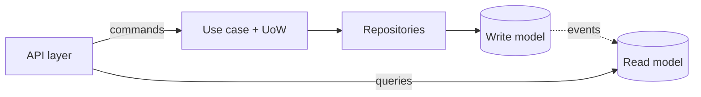

# Advanced Design Patterns

## Overview
Patterns **beyond the GoF catalog**: enterprise and architectural patterns (from Fowler's *PoEAA* and the DDD community) that structure whole applications rather than individual class relationships. They matter once an app has real persistence, changing business rules, and tests that must run without infrastructure.

---

## Pattern Summary

| Pattern | Layer | Problem it solves |
|---|---|---|
| **Dependency Injection** | Wiring | Hidden dependencies, untestable globals |
| **Repository** | Persistence | Domain logic coupled to the database |
| **Unit of Work** | Persistence | Partial writes; scattered commits |
| **Specification** | Domain | Business rules duplicated across queries and code |
| **Null Object** | Domain | `if x is not None` scattered everywhere |
| **Object Pool** | Performance | Expensive resource creation (connections, workers) |
| **CQRS** | Architecture | One model strained by both reads and writes |
| **Event Sourcing** | Architecture | Needing full history, audit, or replay |

---

## Dependency Injection (DI)

- Objects **receive** their dependencies (via constructor or parameters) instead of creating or importing them — the single biggest lever for testability.
- Python needs no framework: default arguments and `Protocol` types are enough. FastAPI's `Depends` (see [[71.03 FastAPI]]) is DI built into the routing layer.

```python
class ReportService:
    def __init__(self, repo: OrderRepo, clock: Callable[[], datetime] = datetime.now):
        self.repo, self.clock = repo, clock   # swap both in tests
```

> [!TIP] DI replaces Singleton
> Build the object once at the **composition root** (app startup) and pass it down. Same "one instance" effect, none of the hidden global state.

---

## Repository

- An in-memory-collection-like interface (`add`, `get`, `list_by(...)`) that hides **how** domain objects are stored.
- Domain code never sees SQL/ORM; tests use a `FakeRepo` backed by a dict.
- Contrast: using ORM models directly everywhere couples business logic to the schema and makes unit tests need a database.

---

## Unit of Work (UoW)

- Tracks changes in one **business transaction** and commits them atomically — either everything persists or nothing does.
- In Python, naturally a **context manager** wrapping a session/transaction:

```python
with uow:
    order = uow.orders.get(order_id)
    order.mark_paid()
    uow.commit()          # one atomic commit for all changes
```

- Pairs with Repository: the UoW owns the session; repositories ride on it.

---

## Specification

- A business rule as an object/function that answers `is_satisfied_by(candidate)`, composable with and/or/not.
- One rule definition serves validation, filtering, and query building — no drift between "the code check" and "the SQL WHERE".
- Lightweight Python version: predicates (`Callable[[T], bool]`) combined with small helpers; same registry idea as [[71.10 Policy Pattern over Boolean Flags]].

---

## Null Object

- Replace `None` with a do-nothing implementation of the expected interface, eliminating `if x is not None` branches.

> [!EXAMPLE]
> `NullNotifier.send(msg)` silently does nothing — callers notify unconditionally; configuration decides whether a real or null notifier is injected.

---

## Object Pool

- Reuse expensive-to-create objects (DB connections, browser instances, GPU workers) from a bounded pool instead of creating per use.
- Usually consumed, not written: SQLAlchemy engine pools, `urllib3` connection pools, `multiprocessing.Pool`. Hand-roll only for custom resources.

---

## CQRS (Command Query Responsibility Segregation)

- Split the model that **changes** state (commands, normalized, validated) from the model that **reads** it (queries, denormalized, fast).
- Ranges from mild (separate read services / DB replicas for queries) to full (separate stores synced by events).

> [!WARNING] Escalation, not default
> Full CQRS adds eventual consistency and sync machinery. Start with one model; split only when read and write requirements genuinely diverge (analytics-heavy dashboards over an OLTP core).

---

## Event Sourcing

- Persist the **sequence of events** (`OrderPlaced`, `ItemAdded`, `OrderPaid`) as the source of truth; current state is derived by replaying them.
- Buys: complete audit trail, time travel/debugging, rebuildable projections; natural partner to CQRS read models.
- Costs: event schema versioning, snapshotting for long streams, harder ad-hoc queries. Same trade-off family as append-only feature logs in [[22.02 Feature Store]].

---

## How They Compose



A typical "clean architecture" Python service = DI at the composition root + Repository/UoW around persistence + Specification for rules; CQRS and Event Sourcing appear only when scale or audit demands them.

---

## Related Concepts
- [[71_Python_Snippets_MOC]] - Parent MOC
- [[71.11 Design Patterns]] - GoF foundations these build on
- [[71.12 Creational Design Patterns]] - DI supersedes Singleton/manual factories
- [[71.14 Behavioral Design Patterns]] - Command & Observer underlie CQRS/Event Sourcing
- [[71.03 FastAPI]] - `Depends` as built-in dependency injection
- [[71.07 SOLID Principles]] - DIP is the principle behind DI and Repository
- [[31.01 ML System Design Patterns]] - system-scale counterparts of these ideas
