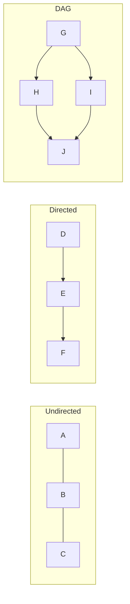

# Graph Algorithms

## Overview

A **Graph** is a data structure consisting of **vertices** (nodes) and **edges** (connections). Graphs model relationships and networks, forming the foundation for pathfinding, connectivity, and optimization algorithms.

## Graph Types

| Type | Definition | Example |
|------|------------|---------|
| **Undirected** | Edges have no direction | Social networks (friendship) |
| **Directed (Digraph)** | Edges have direction (u → v) | Web links, dependencies |
| **DAG** | Directed Acyclic Graph (no cycles) | Build systems, task scheduling |
| **Weighted** | Edges have costs/distances | Road networks, latency |
| **Unweighted** | All edges equal weight | Maze, BFS shortest path |

## Graph Representations

| Representation | Space | Edge Lookup | Best For |
|----------------|-------|-------------|----------|
| **Adjacency Matrix** | $O(V^2)$ | $O(1)$ | Dense graphs, quick edge check |
| **Adjacency List** | $O(V + E)$ | $O(degree)$ | Sparse graphs, iteration |
| **Edge List** | $O(E)$ | $O(E)$ | Simple storage, Kruskal's |

## Key Algorithms

### Traversal

| Algorithm | Time | Space | Use Case |
|-----------|------|-------|----------|
| **BFS** | $O(V + E)$ | $O(V)$ | Shortest path (unweighted), level-order |
| **DFS** | $O(V + E)$ | $O(V)$ | Cycle detection, topological sort |

### Shortest Path

| Algorithm | Graph Type | Time | Negative Weights |
|-----------|------------|------|------------------|
| **BFS** | Unweighted | $O(V + E)$ | N/A |
| **Dijkstra** | Non-negative | $O((V+E) \log V)$ | ❌ |
| **Bellman-Ford** | Any | $O(VE)$ | ✅ |
| **Floyd-Warshall** | All pairs | $O(V^3)$ | ✅ |

### Minimum Spanning Tree

| Algorithm | Time | Approach |
|-----------|------|----------|
| **Kruskal's** | $O(E \log E)$ | Sort edges, union-find |
| **Prim's** | $O((V+E) \log V)$ | Grow from vertex, priority queue |

### DAG-Specific

| Algorithm | Purpose | Time |
|-----------|---------|------|
| **Topological Sort** | Linear ordering respecting dependencies | $O(V + E)$ |
| **DAG Shortest Path** | Shortest path in topological order | $O(V + E)$ |
| **Longest Path** | Only solvable efficiently on DAG | $O(V + E)$ |

## Directed Acyclic Graph (DAG)

A **DAG** is a directed graph with **no cycles**. Essential for:

| Application | Why DAG |
|-------------|---------|
| Build systems (Make, Bazel) | Task dependencies |
| Package managers | Dependency resolution |
| Git commits | Version history |
| Neural networks | Layer computation |
| Spreadsheets | Formula dependencies |

> [!TIP] Detecting DAG
> A directed graph is a DAG if and only if topological sort succeeds (no back edges in DFS).

## Cycle Detection

| Graph Type | Method |
|------------|--------|
| Undirected | DFS with parent tracking |
| Directed | DFS with 3-color (white/gray/black) |
| Directed | Topological sort fails = has cycle |

## Practical Use Cases

| Problem | Algorithm |
|---------|-----------|
| Social network distance | BFS |
| Web crawler | DFS |
| GPS navigation | Dijkstra / A* |
| Course prerequisites | Topological Sort |
| Network reliability | Min Cut / Max Flow |
| Compiler ordering | DAG + Topological Sort |

## Related Concepts

- [[72_Algorithms_MOC]]
- [[72.14 Tree Traversals]]
- [[72.31 Binary Tree]]
- [[72.16 Heap and Priority Queue]]
- [[72.07 Greedy Technique]]
