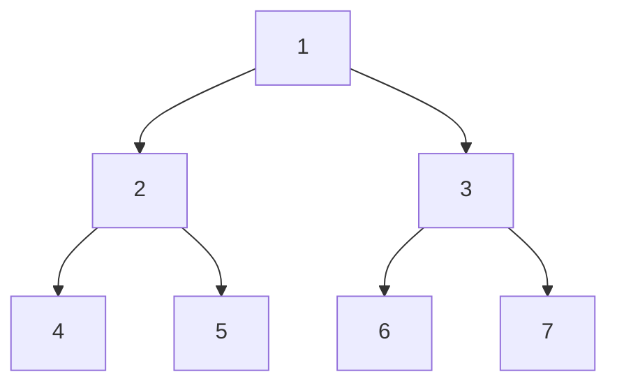

# Tree Traversals

## Overview

**Tree traversal** is the process of visiting all nodes in a tree data structure exactly once. The order of visiting determines the traversal type and is crucial for different applications like expression evaluation, serialization, and search.

## Key Concepts

| Term | Definition |
|------|------------|
| **Visit** | Process a node (read, print, compute) |
| **Depth-first** | Go deep before going wide (Pre/In/Post) |
| **Breadth-first** | Go level by level (Level-order) |
| **Recursive** | Natural implementation for DFS |
| **Iterative** | Uses explicit stack/queue |

## Traversal Types



| Traversal | Order | Result | Mnemonic |
|-----------|-------|--------|----------|
| **Preorder** | Node → Left → Right | 1,2,4,5,3,6,7 | **N**LR |
| **Inorder** | Left → Node → Right | 4,2,5,1,6,3,7 | L**N**R |
| **Postorder** | Left → Right → Node | 4,5,2,6,7,3,1 | LR**N** |
| **Level-order** | Top to bottom, left to right | 1,2,3,4,5,6,7 | BFS |

## Complexity

| Traversal | Time | Space |
|-----------|------|-------|
| All DFS (recursive) | $O(n)$ | $O(h)$ stack |
| All DFS (iterative) | $O(n)$ | $O(h)$ stack |
| Level-order | $O(n)$ | $O(w)$ queue |

Where $h$ = height, $w$ = max width of tree.

## Pseudocode

### Preorder (NLR)

```
preorder(node):
    if node is null: return
    visit(node)
    preorder(node.left)
    preorder(node.right)
```

### Inorder (LNR)

```
inorder(node):
    if node is null: return
    inorder(node.left)
    visit(node)
    inorder(node.right)
```

### Postorder (LRN)

```
postorder(node):
    if node is null: return
    postorder(node.left)
    postorder(node.right)
    visit(node)
```

### Level-order (BFS)

```
levelOrder(root):
    queue = [root]
    while queue not empty:
        node = queue.dequeue()
        visit(node)
        if node.left: queue.enqueue(node.left)
        if node.right: queue.enqueue(node.right)
```

## Use Cases

| Traversal | Application |
|-----------|-------------|
| **Preorder** | Copy tree, serialize, prefix expression |
| **Inorder** | BST sorted order, infix expression |
| **Postorder** | Delete tree, postfix expression, dependency resolution |
| **Level-order** | Shortest path, level-by-level processing |

> [!TIP] BST Property
> **Inorder** traversal of a Binary Search Tree yields elements in **sorted order**.

## Iterative Implementations

Using explicit stack for DFS traversals:

| Traversal | Stack Strategy |
|-----------|----------------|
| Preorder | Push right, then left (so left pops first) |
| Inorder | Go left until null, pop & visit, then go right |
| Postorder | Two stacks, or reverse of (Node → Right → Left) |

## Morris Traversal

$O(1)$ space traversal using **threaded binary tree** (temporary right pointers):

| Aspect | Value |
|--------|-------|
| Time | $O(n)$ |
| Space | $O(1)$ |
| Modifies tree | Temporarily (restores after) |

## Related Concepts

- [[72_Algorithms_MOC]] - Parent category
- [[72.13 Graph Algorithms]] - Generalization to graph traversals
- [[72.31 Binary Tree]] - Primary data structure traversed
- [[72.23 Binary Search]] - Uses in-order for BST
