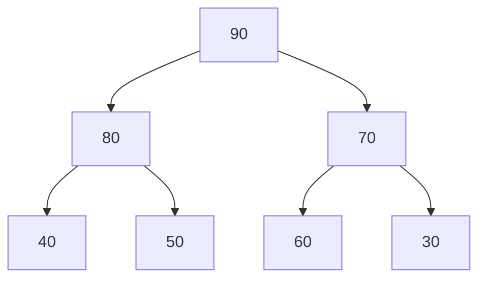

# Heap and Priority Queue

## Overview

A **Heap** is a complete binary tree satisfying the **heap property**: parent nodes are always greater (max-heap) or smaller (min-heap) than children. **Priority Queue** is an ADT typically implemented with a heap, providing efficient access to the highest/lowest priority element.

## Key Concepts

| Term | Definition |
|------|------------|
| **Complete binary tree** | All levels filled except possibly the last, filled left to right |
| **Max-heap** | Parent ≥ children; root is maximum |
| **Min-heap** | Parent ≤ children; root is minimum |
| **Heapify** | Restore heap property after modification |
| **Array representation** | Parent at $i$, children at $2i+1$, $2i+2$ |

## Heap Structure



**Array representation**: `[90, 80, 70, 40, 50, 60, 30]`

| Index | Parent | Left Child | Right Child |
|-------|--------|------------|-------------|
| $i$ | $(i-1)/2$ | $2i + 1$ | $2i + 2$ |

## Operations Complexity

| Operation | Time | Description |
|-----------|------|-------------|
| **peek** | $O(1)$ | Access root (min/max) |
| **insert** | $O(\log n)$ | Add element, bubble up |
| **extract** | $O(\log n)$ | Remove root, bubble down |
| **heapify** | $O(\log n)$ | Fix single violation |
| **build heap** | $O(n)$ | Convert array to heap |
| **delete** | $O(\log n)$ | Remove arbitrary element |

> [!INFO] Build Heap is $O(n)$
> Not $O(n \log n)$! Most nodes are near leaves, so heapify costs less. Sum: $\sum_{h=0}^{\log n} \frac{n}{2^{h+1}} \cdot O(h) = O(n)$

## Heap Operations

### Insert (Bubble Up)
1. Add element at end (maintain completeness)
2. Compare with parent, swap if violates heap property
3. Repeat until root or property satisfied

### Extract (Bubble Down)
1. Remove root, replace with last element
2. Compare with children, swap with larger (max) or smaller (min)
3. Repeat until leaf or property satisfied

## Heap Variants

| Variant | Description | Use Case |
|---------|-------------|----------|
| **Binary heap** | Standard 2 children | General purpose |
| **D-ary heap** | D children per node | Decrease-key heavy |
| **Fibonacci heap** | Amortized $O(1)$ decrease-key | Dijkstra's algorithm |
| **Binomial heap** | Mergeable in $O(\log n)$ | Merge-heavy workloads |
| **Pairing heap** | Simple, good practical performance | Competitive alternative |

## Priority Queue Interface

| Operation | Description | Heap Implementation |
|-----------|-------------|---------------------|
| `push(item, priority)` | Add item | Insert: $O(\log n)$ |
| `pop()` | Remove highest priority | Extract: $O(\log n)$ |
| `peek()` | View highest priority | Access root: $O(1)$ |
| `update(item, priority)` | Change priority | Decrease/increase key |

## Language Libraries

| Language | Min-Heap | Max-Heap |
|----------|----------|----------|
| Python | `heapq` (default) | Negate values or `heapq._heapify_max` |
| Java | `PriorityQueue` (default) | Pass `Collections.reverseOrder()` |
| C++ | `priority_queue` (max default) | Use `greater<T>` comparator |

## Practical Use Cases

| Application | Why Heap |
|-------------|----------|
| **Heap Sort** | $O(n \log n)$ in-place sorting |
| **Dijkstra's** | Efficient minimum extraction |
| **Top-K elements** | Maintain K largest/smallest |
| **Median finding** | Two heaps (max + min) |
| **Task scheduling** | Priority-based execution |
| **Merge K lists** | Efficient multi-way merge |

## Top-K Pattern

```
findTopK(stream, k):
    minHeap = []  # Size k
    for item in stream:
        if len(minHeap) < k:
            push(minHeap, item)
        elif item > minHeap[0]:
            pop(minHeap)
            push(minHeap, item)
    return minHeap
```

> [!TIP] Use min-heap for top-K largest, max-heap for top-K smallest. This way you can efficiently discard the smallest of your candidates.

## Related Concepts

- [[72_Algorithms_MOC]]
- [[72.24 Heap Sort]]
- [[72.18 Sorting Algorithms Comparison]]
- [[72.07 Greedy Technique]]
