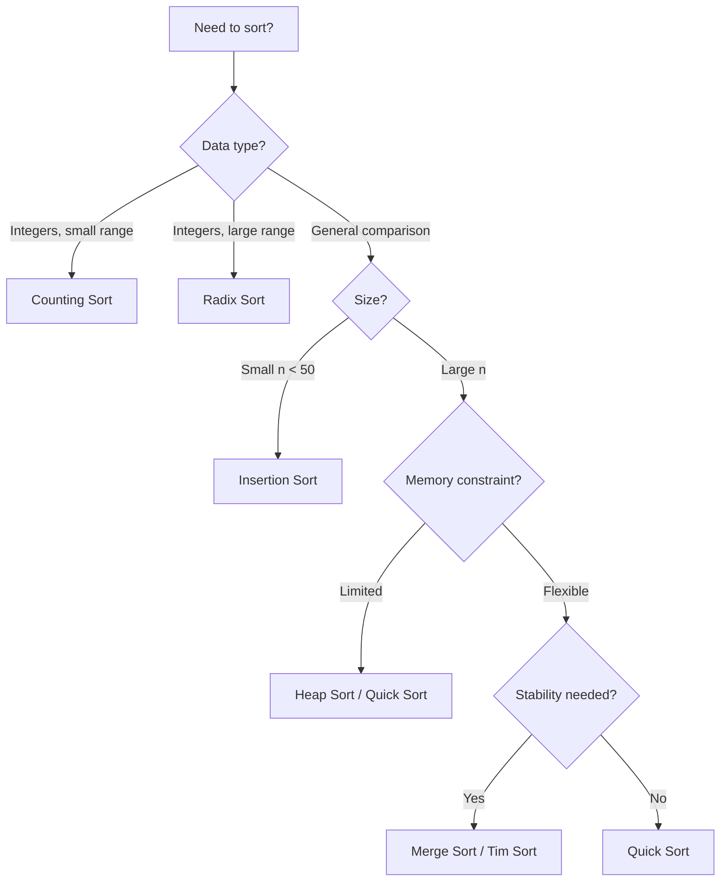

# Sorting Algorithms Comparison

## Overview

Sorting is a fundamental operation that organizes elements in a specific order. Choosing the right algorithm depends on data size, memory constraints, stability requirements, and whether data is nearly sorted.

## Key Concepts

| Term | Definition |
|------|------------|
| **Stable** | Preserves relative order of equal elements |
| **In-place** | Uses $O(1)$ extra space |
| **Adaptive** | Faster on partially sorted input |
| **Comparison-based** | Only uses comparisons (lower bound: $\Omega(n \log n)$) |

## Comparison Table

| Algorithm | Best | Average | Worst | Space | Stable | Adaptive |
|-----------|------|---------|-------|-------|--------|----------|
| **Bubble Sort** | $O(n)$ | $O(n^2)$ | $O(n^2)$ | $O(1)$ | ✅ | ✅ |
| **Insertion Sort** | $O(n)$ | $O(n^2)$ | $O(n^2)$ | $O(1)$ | ✅ | ✅ |
| **Selection Sort** | $O(n^2)$ | $O(n^2)$ | $O(n^2)$ | $O(1)$ | ❌ | ❌ |
| **Merge Sort** | $O(n \log n)$ | $O(n \log n)$ | $O(n \log n)$ | $O(n)$ | ✅ | ❌ |
| **Quick Sort** | $O(n \log n)$ | $O(n \log n)$ | $O(n^2)$ | $O(\log n)$ | ❌ | ❌ |
| **Heap Sort** | $O(n \log n)$ | $O(n \log n)$ | $O(n \log n)$ | $O(1)$ | ❌ | ❌ |
| **Tim Sort** | $O(n)$ | $O(n \log n)$ | $O(n \log n)$ | $O(n)$ | ✅ | ✅ |
| **Counting Sort** | $O(n+k)$ | $O(n+k)$ | $O(n+k)$ | $O(k)$ | ✅ | ❌ |
| **Radix Sort** | $O(nk)$ | $O(nk)$ | $O(nk)$ | $O(n+k)$ | ✅ | ❌ |

> [!INFO] $k$ = range of values (Counting) or number of digits (Radix)

## Algorithm Selection Guide

## When to Use Each

| Scenario | Best Choice | Reason |
|----------|-------------|--------|
| General purpose | **Tim Sort** | Python/Java default; adaptive + stable |
| Memory-constrained | **Heap Sort** | Guaranteed $O(1)$ space |
| Nearly sorted data | **Insertion Sort** | $O(n)$ best case |
| External sorting | **Merge Sort** | Sequential access, stable |
| Random access, speed | **Quick Sort** | Best cache performance |
| Integers in known range | **Counting Sort** | $O(n)$ when $k = O(n)$ |
| Fixed-length strings/ints | **Radix Sort** | $O(n)$ for constant $k$ digits |

## Key Insights

> [!TIP] Quick Sort Optimizations
> - **Median-of-three** pivot selection avoids worst case
> - **Tail recursion** optimization reduces stack space
> - Switch to **Insertion Sort** for small subarrays (~10 elements)

> [!WARNING] Quick Sort Pitfall
> Worst case $O(n^2)$ on already sorted data with naive pivot. Use randomized pivot or Introsort.

### Hybrid Algorithms

| Algorithm | Combination | Used In |
|-----------|-------------|---------|
| **Tim Sort** | Merge + Insertion | Python, Java |
| **Introsort** | Quick + Heap + Insertion | C++ STL |
| **Block Sort** | Merge + Insertion (in-place) | WikiSort |

## Practical Use Cases

- **Database ORDER BY**: Tim Sort (stable, adaptive)
- **Real-time systems**: Heap Sort (predictable $O(n \log n)$)
- **Embedded systems**: Insertion Sort (small $n$, in-place)
- **Distributed sorting**: Merge Sort (parallelizable)
- **String sorting**: Radix Sort / MSD Radix

## Related Concepts

- [[72_Algorithms_MOC]] - Parent category
- [[72.16 Heap and Priority Queue]] - Data structure for heap sort
- [[72.03 Divide-and-Conquer]] - Paradigm for merge/quick sort
- [[72.05 Space and Time Trade-Offs]] - Memory vs speed decisions
