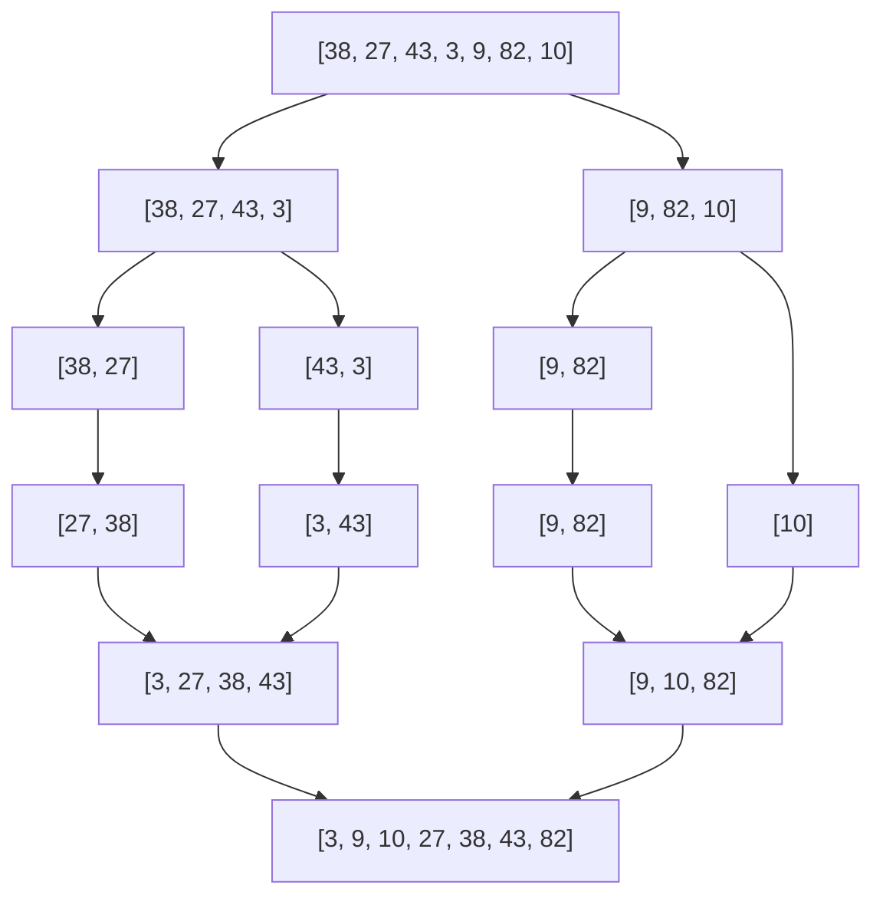

# Merge Sort

## Overview

**Merge Sort** is a stable divide-and-conquer sorting algorithm that recursively divides the array in half, sorts each half, then **merges** the sorted halves. Guaranteed $O(n \log n)$ time but requires $O(n)$ auxiliary space.

## Key Concepts

| Term | Definition |
|------|------------|
| **Stable** | Preserves relative order of equal elements |
| **Merge** | Combining two sorted arrays into one sorted array |
| **Top-down** | Recursive approach (divide first) |
| **Bottom-up** | Iterative approach (merge pairs first) |

## Algorithm Steps



1. **Divide**: Split array into two halves
2. **Recurse**: Sort each half recursively
3. **Merge**: Combine sorted halves using two-pointer technique
4. **Base case**: Single element (already sorted)

## Complexity Analysis

| Metric | Complexity | Notes |
|--------|------------|-------|
| Time (all cases) | $O(n \log n)$ | Always divides evenly |
| Space | $O(n)$ | Auxiliary array for merging |
| Comparisons | $O(n \log n)$ | Optimal for comparison-based |
| Stable | ✅ Yes | Equal elements keep order |

> [!INFO] Why Always $O(n \log n)$?
> Division is always balanced ($\log n$ levels) and merging each level is $O(n)$ work.

## Merge Operation

The **merge** step is the core operation:

```
merge(arr, left, mid, right):
    L = arr[left..mid]
    R = arr[mid+1..right]
    i, j, k = 0, 0, left

    while i < len(L) and j < len(R):
        if L[i] <= R[j]:    # <= ensures stability
            arr[k] = L[i]
            i += 1
        else:
            arr[k] = R[j]
            j += 1
        k += 1

    copy remaining L or R to arr
```

## Variants

| Variant | Description | Trade-off |
|---------|-------------|-----------|
| **Top-down** | Recursive, divide first | Simple, more stack usage |
| **Bottom-up** | Iterative, merge pairs | No recursion overhead |
| **Natural** | Exploit existing runs | Faster on partially sorted |
| **In-place** | Block merge technique | Complex, higher constants |
| **Parallel** | Merge in parallel | Excellent parallelization |

## Top-Down vs Bottom-Up

| Aspect | Top-Down | Bottom-Up |
|--------|----------|-----------|
| Approach | Recursive | Iterative |
| Stack | $O(\log n)$ | $O(1)$ |
| Implementation | Simpler | Slightly complex |
| Cache | Similar | Slightly better |

## When to Use

| Good Fit | Poor Fit |
|----------|----------|
| Stability required | Memory constrained |
| Linked lists | Small arrays (use insertion) |
| External sorting | Cache-critical applications |
| Parallel sorting | In-place requirement |
| Guaranteed worst case | Simple/quick solution needed |

> [!TIP] Linked List Advantage
> Merge Sort is ideal for linked lists: merging requires no extra space, and random access isn't needed.

## Practical Applications

| Application | Why Merge Sort |
|-------------|----------------|
| **External sorting** | Sequential access pattern |
| **Database sorting** | Stability for multi-key |
| **Parallel systems** | Easily parallelizable |
| **Linked lists** | $O(1)$ merge space |
| **Counting inversions** | Modified merge counts swaps |

## Tim Sort Connection

**Tim Sort** (Python/Java default) is a hybrid that:
- Uses **Merge Sort** for combining runs
- Uses **Insertion Sort** for small runs
- Detects and exploits natural runs
- Achieves $O(n)$ on nearly sorted data

## Related Concepts

- [[72_Algorithms_MOC]] - Parent category
- [[72.03 Divide-and-Conquer]] - Paradigm: split and merge
- [[72.18 Sorting Algorithms Comparison]] - Context: when to choose merge sort
- [[72.21 Quick Sort]] - Contrast: in-place, cache-friendly alternative
