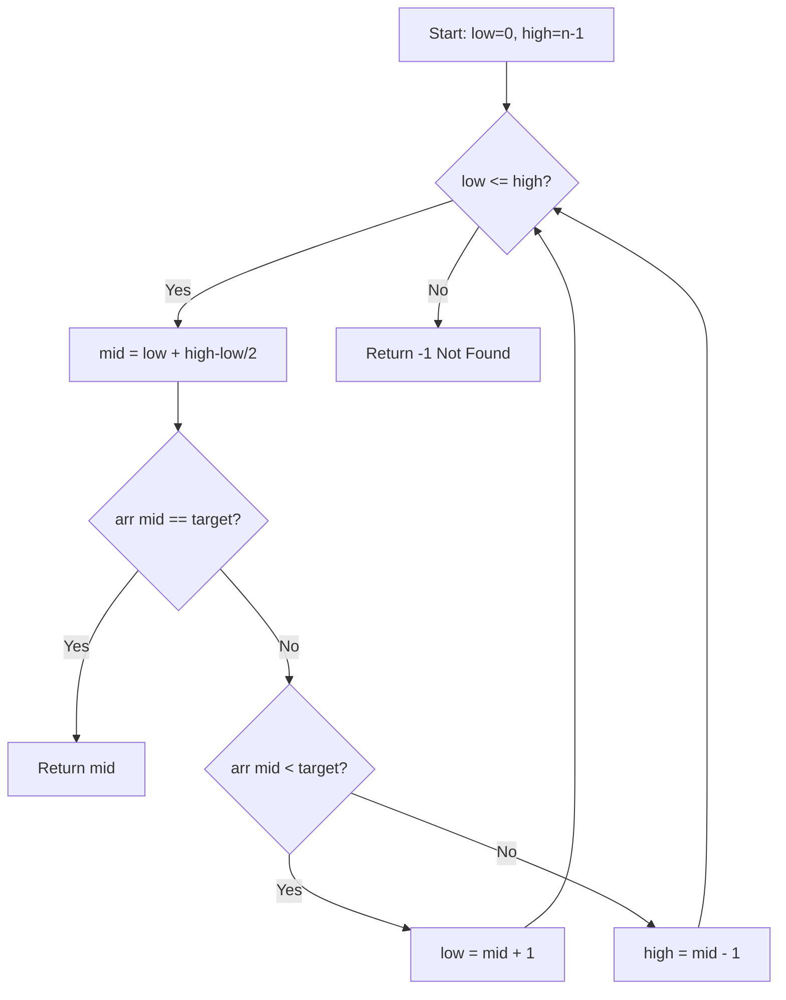

# Binary Search

## Overview

**Binary Search** is a decrease-and-conquer algorithm that finds a target in a **sorted** array by repeatedly halving the search space. Achieves $O(\log n)$ time complexity, making it essential for efficient lookups.

## Key Concepts

| Term | Definition |
|------|------------|
| **Sorted array** | Prerequisite for binary search |
| **Search space** | Range of possible indices |
| **Mid point** | $(low + high) / 2$ or $low + (high - low) / 2$ |
| **Invariant** | Target is always within $[low, high]$ |

## Algorithm Flow



## Basic Template

```
binarySearch(arr, target):
    low, high = 0, len(arr) - 1

    while low <= high:
        mid = low + (high - low) // 2  # Avoids overflow

        if arr[mid] == target:
            return mid
        elif arr[mid] < target:
            low = mid + 1
        else:
            high = mid - 1

    return -1  # Not found
```

> [!WARNING] Integer Overflow
> Use `low + (high - low) // 2` instead of `(low + high) // 2` to prevent overflow in languages without arbitrary precision integers.

## Complexity

| Metric | Value |
|--------|-------|
| Time | $O(\log n)$ |
| Space | $O(1)$ iterative, $O(\log n)$ recursive |
| Comparisons | At most $\lceil \log_2(n+1) \rceil$ |

## Common Variants

| Variant | Returns | Use Case |
|---------|---------|----------|
| **Basic** | Index of target or -1 | Exact match |
| **Lower bound** | First index ≥ target | Insertion point |
| **Upper bound** | First index > target | Range queries |
| **First occurrence** | Leftmost match | Duplicates |
| **Last occurrence** | Rightmost match | Duplicates |

## Lower/Upper Bound Templates

### Lower Bound (First index ≥ target)

```
lowerBound(arr, target):
    low, high = 0, len(arr)
    while low < high:
        mid = low + (high - low) // 2
        if arr[mid] < target:
            low = mid + 1
        else:
            high = mid
    return low
```

### Upper Bound (First index > target)

```
upperBound(arr, target):
    low, high = 0, len(arr)
    while low < high:
        mid = low + (high - low) // 2
        if arr[mid] <= target:
            low = mid + 1
        else:
            high = mid
    return low
```

## Advanced Patterns

| Pattern | Description | Example |
|---------|-------------|---------|
| **Rotated array** | Find pivot or search | `[4,5,6,7,0,1,2]` |
| **Peak finding** | Find local maximum | Mountain array |
| **Minimize maximum** | Binary search on answer | Allocate books |
| **Square root** | Search for $x$ where $x^2 \leq n$ | Integer sqrt |
| **First bad version** | Search in boolean array | Git bisect |

## Search on Answer Space

Binary search isn't just for arrays—use it when:
- Answer is in a **monotonic** range $[lo, hi]$
- You can **verify** if a value is valid in $O(n)$ or better

```
searchOnAnswer(lo, hi, isValid):
    while lo < hi:
        mid = lo + (hi - lo) // 2
        if isValid(mid):
            hi = mid      # Try smaller
        else:
            lo = mid + 1  # Need larger
    return lo
```

> [!TIP] Recognition Pattern
> "Minimize the maximum" or "Maximize the minimum" problems often use binary search on the answer space.

## Common Mistakes

| Mistake | Problem | Fix |
|---------|---------|-----|
| `(low + high) / 2` | Integer overflow | Use `low + (high - low) / 2` |
| `while low < high` vs `<=` | Off-by-one | Match with `mid±1` logic |
| `mid = (low + high) / 2` | Infinite loop | Use `mid + 1` for lower bound |
| Unsorted input | Incorrect results | Always verify sorted |

## When to Use

| Good Fit | Poor Fit |
|----------|----------|
| Sorted/monotonic data | Unsorted data |
| Random access (arrays) | Linked lists |
| $O(\log n)$ lookups needed | Frequent insertions |
| Search on answer space | Non-monotonic conditions |

## Language Standard Libraries

| Language | Lower Bound | Upper Bound |
|----------|-------------|-------------|
| Python | `bisect.bisect_left()` | `bisect.bisect_right()` |
| C++ | `std::lower_bound()` | `std::upper_bound()` |
| Java | `Arrays.binarySearch()` | Manual implementation |
| JavaScript | Manual | Manual |

## Related Concepts

- [[72_Algorithms_MOC]] - Parent category
- [[72.03 Divide-and-Conquer]] - Paradigm: halving search space
- [[72.17 Binary Search Patterns]] - Advanced patterns and templates
