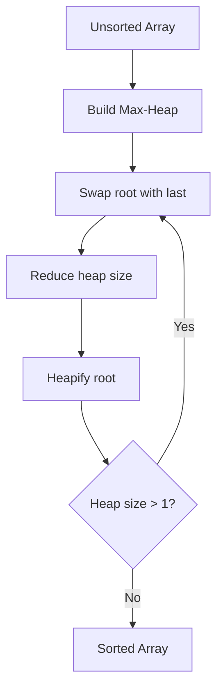

# Heap Sort

## Overview

**Heap Sort** is an in-place comparison-based sorting algorithm that uses a **binary heap** data structure. It builds a max-heap, then repeatedly extracts the maximum to the end of the array. Guaranteed $O(n \log n)$ time with $O(1)$ extra space.

## Key Concepts

| Term | Definition |
|------|------------|
| **Build heap** | Convert array into max-heap in $O(n)$ |
| **Extract max** | Remove root, restore heap in $O(\log n)$ |
| **In-place** | Uses $O(1)$ auxiliary space |
| **Unstable** | Equal elements may change relative order |

## Algorithm Steps



1. **Build max-heap** from input array — $O(n)$
2. **Swap** root (max) with last element
3. **Reduce** heap size by 1
4. **Heapify** root to restore heap property — $O(\log n)$
5. **Repeat** steps 2-4 until heap size is 1

## Complexity Analysis

| Metric | Complexity |
|--------|------------|
| Best | $O(n \log n)$ |
| Average | $O(n \log n)$ |
| Worst | $O(n \log n)$ |
| Space | $O(1)$ |
| Stable | ❌ No |

> [!INFO] Why Always $O(n \log n)$?
> Build heap is $O(n)$, then $n$ extractions each costing $O(\log n)$. Total: $O(n) + O(n \log n) = O(n \log n)$

## Pseudocode

```
heapSort(arr):
    n = len(arr)

    # Build max-heap (heapify from last non-leaf)
    for i = n/2 - 1 down to 0:
        heapify(arr, n, i)

    # Extract elements one by one
    for i = n - 1 down to 1:
        swap(arr[0], arr[i])    # Move max to end
        heapify(arr, i, 0)      # Heapify reduced heap

heapify(arr, heapSize, i):
    largest = i
    left = 2*i + 1
    right = 2*i + 2

    if left < heapSize and arr[left] > arr[largest]:
        largest = left
    if right < heapSize and arr[right] > arr[largest]:
        largest = right

    if largest != i:
        swap(arr[i], arr[largest])
        heapify(arr, heapSize, largest)
```

## Comparison with Other Sorts

| Aspect | Heap Sort | Quick Sort | Merge Sort |
|--------|-----------|------------|------------|
| Worst case | $O(n \log n)$ ✅ | $O(n^2)$ | $O(n \log n)$ |
| Space | $O(1)$ ✅ | $O(\log n)$ | $O(n)$ |
| Stable | ❌ | ❌ | ✅ |
| Cache | Poor | Excellent | Good |
| Adaptive | ❌ | ❌ | ❌ |

## Strengths and Weaknesses

| Strengths | Weaknesses |
|-----------|------------|
| Guaranteed $O(n \log n)$ | Poor cache locality |
| $O(1)$ space | Not stable |
| No worst-case degradation | Slower in practice than Quick Sort |
| Good for memory-constrained | Not adaptive to sorted input |

> [!WARNING] Cache Performance
> Heap Sort has poor cache locality due to non-sequential memory access during heapify. Quick Sort often outperforms it despite similar complexity.

## When to Use

| Good Fit | Poor Fit |
|----------|----------|
| Memory constrained systems | Cache performance critical |
| Guaranteed worst-case needed | Stability required |
| Embedded systems | Already partially sorted |
| Real-time systems (predictable) | Fastest average case needed |

## Introsort Connection

**Introsort** (C++ STL `std::sort`) uses Heap Sort as a fallback:
1. Start with Quick Sort
2. If recursion depth exceeds $2 \log n$, switch to Heap Sort
3. Use Insertion Sort for small subarrays

This combines Quick Sort's speed with Heap Sort's guaranteed $O(n \log n)$.

## Related Concepts

- [[72_Algorithms_MOC]]
- [[72.16 Heap and Priority Queue]]
- [[72.21 Quick Sort]]
- [[72.18 Sorting Algorithms Comparison]]
