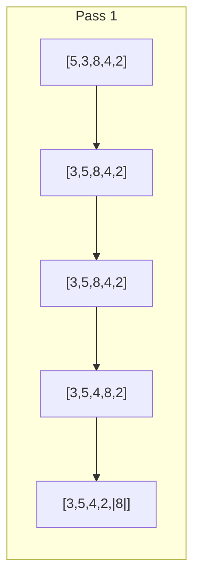

# Bubble Sort

## Overview

**Bubble Sort** is a simple comparison-based sorting algorithm that repeatedly steps through the list, compares adjacent elements, and swaps them if they're in the wrong order. The largest elements "bubble up" to the end. Easy to understand but inefficient for large datasets.

## Key Concepts

| Term | Definition |
|------|------------|
| **Pass** | One complete iteration through the array |
| **Bubble up** | Largest element moves to correct position each pass |
| **Adaptive** | Can detect sorted input and terminate early |
| **Stable** | Equal elements maintain relative order |

## Algorithm Visualization



After each pass, the largest unsorted element is in its final position.

## Algorithm Steps

1. Compare adjacent pairs from start to end
2. Swap if left > right
3. After each pass, largest is at correct position
4. Reduce comparison range by 1
5. Stop when no swaps occur (optimized) or after n-1 passes

## Complexity Analysis

| Case | Time | When |
|------|------|------|
| Best | $O(n)$ | Already sorted (with optimization) |
| Average | $O(n^2)$ | Random order |
| Worst | $O(n^2)$ | Reverse sorted |
| Space | $O(1)$ | In-place |

## Pseudocode

### Basic Version

```
bubbleSort(arr):
    n = len(arr)
    for i = 0 to n-1:
        for j = 0 to n-i-2:
            if arr[j] > arr[j+1]:
                swap(arr[j], arr[j+1])
```

### Optimized Version (Early Termination)

```
bubbleSortOptimized(arr):
    n = len(arr)
    for i = 0 to n-1:
        swapped = false
        for j = 0 to n-i-2:
            if arr[j] > arr[j+1]:
                swap(arr[j], arr[j+1])
                swapped = true
        if not swapped:
            break  # Already sorted
```

> [!TIP] Early Termination
> Adding a `swapped` flag makes Bubble Sort $O(n)$ on already-sorted arrays.

## Characteristics

| Property | Value |
|----------|-------|
| Stable | ✅ Yes |
| In-place | ✅ Yes |
| Adaptive | ✅ Yes (with optimization) |
| Online | ❌ No |

## Comparison with Simple Sorts

| Algorithm | Best | Average | Worst | Swaps | Adaptive |
|-----------|------|---------|-------|-------|----------|
| Bubble Sort | $O(n)$ | $O(n^2)$ | $O(n^2)$ | $O(n^2)$ | ✅ |
| Insertion Sort | $O(n)$ | $O(n^2)$ | $O(n^2)$ | $O(n^2)$ | ✅ |
| Selection Sort | $O(n^2)$ | $O(n^2)$ | $O(n^2)$ | $O(n)$ | ❌ |

> [!WARNING] Rarely Used in Practice
> Bubble Sort is typically outperformed by Insertion Sort which has better constants and fewer swaps on average. Use for educational purposes only.

## When to Use

| Good Fit | Poor Fit |
|----------|----------|
| Educational purposes | Large datasets |
| Detecting sorted data | Performance critical |
| Very small arrays ($n < 10$) | General sorting needs |
| Nearly sorted data (optimized) | Production code |

## Variants

| Variant | Description |
|---------|-------------|
| **Cocktail Shaker Sort** | Bidirectional bubble sort |
| **Comb Sort** | Uses gap larger than 1, shrinks over time |
| **Odd-Even Sort** | Parallel bubble sort variant |

## Related Concepts

- [[72_Algorithms_MOC]]
- [[72.26 Insertion Sort]]
- [[72.27 Selection Sort]]
- [[72.18 Sorting Algorithms Comparison]]
