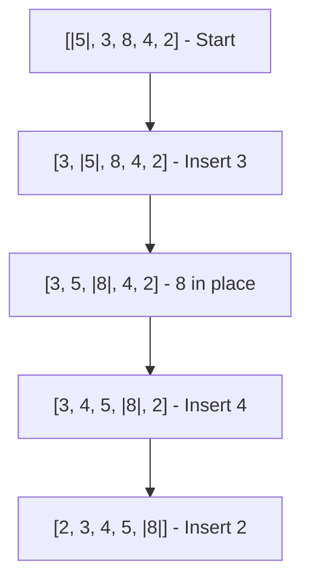

# Insertion Sort

## Overview

**Insertion Sort** builds the sorted array one element at a time by repeatedly picking the next element and inserting it into its correct position among the already-sorted elements. Efficient for small datasets and nearly-sorted arrays.

## Key Concepts

| Term | Definition |
|------|------------|
| **Sorted region** | Left portion of array, grows with each iteration |
| **Key** | Current element being inserted |
| **Shifting** | Moving larger elements right to make room |
| **Online** | Can sort as elements arrive |

## Algorithm Visualization



**Bold** indicates sorted region boundary.

## Algorithm Steps

1. Start with first element (trivially sorted)
2. Pick next element as **key**
3. Compare key with sorted elements from right to left
4. Shift larger elements one position right
5. Insert key at correct position
6. Repeat until all elements processed

## Complexity Analysis

| Case | Time | When |
|------|------|------|
| Best | $O(n)$ | Already sorted |
| Average | $O(n^2)$ | Random order |
| Worst | $O(n^2)$ | Reverse sorted |
| Space | $O(1)$ | In-place |

## Pseudocode

```
insertionSort(arr):
    for i = 1 to len(arr) - 1:
        key = arr[i]
        j = i - 1

        # Shift elements greater than key
        while j >= 0 and arr[j] > key:
            arr[j + 1] = arr[j]
            j = j - 1

        arr[j + 1] = key
```

## Characteristics

| Property | Value |
|----------|-------|
| Stable | ✅ Yes |
| In-place | ✅ Yes |
| Adaptive | ✅ Yes ($O(n)$ on sorted) |
| Online | ✅ Yes (can sort stream) |

> [!TIP] Why Insertion Sort for Small Arrays?
> Low overhead, good cache performance, and $O(n)$ on nearly sorted data. Tim Sort and Introsort switch to Insertion Sort for subarrays of size ~16-32.

## Comparison with Similar Algorithms

| Aspect | Insertion Sort | Selection Sort | Bubble Sort |
|--------|----------------|----------------|-------------|
| Best case | $O(n)$ ✅ | $O(n^2)$ | $O(n)$ |
| Swaps (avg) | $O(n^2)$ | $O(n)$ ✅ | $O(n^2)$ |
| Adaptive | ✅ | ❌ | ✅ |
| Online | ✅ | ❌ | ❌ |
| Stable | ✅ | ❌ | ✅ |

## When to Use

| Good Fit | Poor Fit |
|----------|----------|
| Small arrays ($n < 50$) | Large datasets |
| Nearly sorted data | Random data, large $n$ |
| Online sorting (streaming) | Batch processing large arrays |
| Hybrid algorithm subroutine | Performance-critical paths |
| Stable sort needed, small $n$ | $O(n \log n)$ required |

## Binary Insertion Sort

Reduces comparisons from $O(n)$ to $O(\log n)$ per element using binary search, but shifts still cost $O(n)$:

```
binaryInsertionSort(arr):
    for i = 1 to len(arr) - 1:
        key = arr[i]
        pos = binarySearch(arr, 0, i, key)
        shift arr[pos..i-1] right by 1
        arr[pos] = key
```

| Metric | Standard | Binary |
|--------|----------|--------|
| Comparisons | $O(n^2)$ | $O(n \log n)$ |
| Swaps/Shifts | $O(n^2)$ | $O(n^2)$ |
| Overall | $O(n^2)$ | $O(n^2)$ |

## Shell Sort Connection

**Shell Sort** improves Insertion Sort by comparing elements far apart first:
1. Start with large gap, reduce over iterations
2. Each gap pass uses Insertion Sort
3. Final pass with gap=1 is standard Insertion Sort

This reduces overall shifts, achieving $O(n^{3/2})$ or better depending on gap sequence.

## Related Concepts

- [[72_Algorithms_MOC]] - Parent category
- [[72.25 Bubble Sort]] - Contrast: less efficient on nearly sorted
- [[72.27 Selection Sort]] - Contrast: O(n²) but fewer swaps
- [[72.28 Tim Sort]] - Uses insertion sort for small runs
- [[72.18 Sorting Algorithms Comparison]] - Context: best for small/nearly sorted
