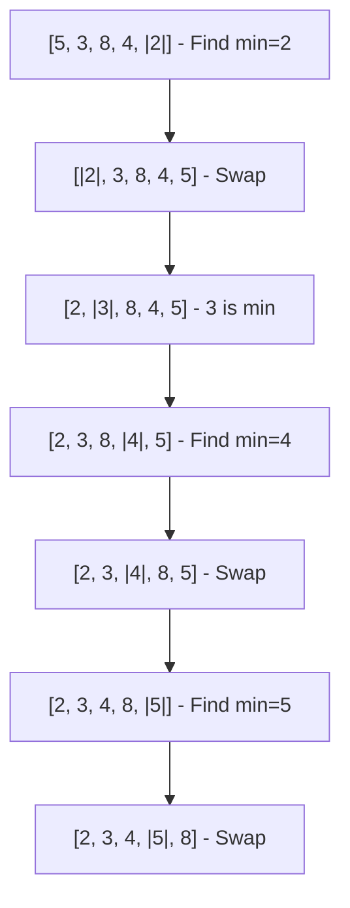

# Selection Sort

## Overview

**Selection Sort** divides the array into sorted and unsorted regions. It repeatedly selects the **minimum** element from the unsorted region and swaps it with the first unsorted element. Simple but inefficient, with exactly $O(n)$ swaps regardless of input.

## Key Concepts

| Term | Definition |
|------|------------|
| **Sorted region** | Left portion containing smallest elements in order |
| **Unsorted region** | Right portion to be processed |
| **Selection** | Finding minimum in unsorted region |
| **Swap** | Placing minimum at boundary |

## Algorithm Visualization



## Algorithm Steps

1. Find **minimum** in unsorted region
2. Swap minimum with first unsorted element
3. Expand sorted region by one
4. Repeat until entire array is sorted

## Complexity Analysis

| Metric | Complexity |
|--------|------------|
| Best | $O(n^2)$ |
| Average | $O(n^2)$ |
| Worst | $O(n^2)$ |
| Space | $O(1)$ |
| Swaps | $O(n)$ — exactly $n-1$ |

> [!INFO] Fixed Number of Swaps
> Selection Sort always makes exactly $n-1$ swaps, making it optimal when swaps are expensive (e.g., large records, flash memory).

## Pseudocode

```
selectionSort(arr):
    n = len(arr)
    for i = 0 to n - 2:
        minIdx = i
        for j = i + 1 to n - 1:
            if arr[j] < arr[minIdx]:
                minIdx = j
        if minIdx != i:
            swap(arr[i], arr[minIdx])
```

## Characteristics

| Property | Value |
|----------|-------|
| Stable | ❌ No (standard implementation) |
| In-place | ✅ Yes |
| Adaptive | ❌ No (always $O(n^2)$) |
| Online | ❌ No |

> [!WARNING] Not Stable
> Standard Selection Sort is unstable. Example: `[2a, 2b, 1]` → `[1, 2b, 2a]` (order of 2s changed).

## Comparison with Simple Sorts

| Aspect | Selection Sort | Insertion Sort | Bubble Sort |
|--------|----------------|----------------|-------------|
| Best case | $O(n^2)$ | $O(n)$ ✅ | $O(n)$ |
| Comparisons | $O(n^2)$ | $O(n^2)$ | $O(n^2)$ |
| Swaps | $O(n)$ ✅ | $O(n^2)$ | $O(n^2)$ |
| Adaptive | ❌ | ✅ | ✅ |
| Stable | ❌ | ✅ | ✅ |

## When to Use

| Good Fit | Poor Fit |
|----------|----------|
| Swap cost is high | Large datasets |
| Memory writes expensive | Stability required |
| Simple implementation needed | Adaptive behavior needed |
| Small arrays | General purpose sorting |

## Variants

| Variant | Description |
|---------|-------------|
| **Double Selection** | Find both min and max each pass |
| **Stable Selection** | Shift instead of swap (costs $O(n)$ shifts) |
| **Bingo Sort** | Optimized for many duplicates |
| **Heap Sort** | Selection with heap for $O(\log n)$ min-finding |

## Stable Selection Sort

To make it stable, shift elements instead of swapping:

```
stableSelectionSort(arr):
    for i = 0 to n - 2:
        minIdx = i
        for j = i + 1 to n - 1:
            if arr[j] < arr[minIdx]:
                minIdx = j
        key = arr[minIdx]
        shift arr[i..minIdx-1] right by 1
        arr[i] = key
```

Trade-off: Swaps become $O(n^2)$ like Insertion Sort.

## Related Concepts

- [[72_Algorithms_MOC]] - Parent category
- [[72.25 Bubble Sort]] - Contrast: more swaps, early termination
- [[72.26 Insertion Sort]] - Contrast: better for nearly sorted
- [[72.24 Heap Sort]] - Optimized selection via heap
- [[72.18 Sorting Algorithms Comparison]] - Context: O(n) swaps advantage
