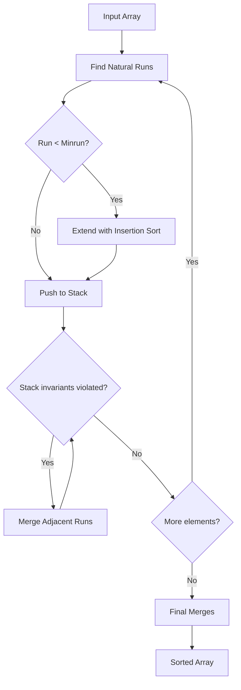

# Tim Sort

## Overview

**Tim Sort** is a hybrid stable sorting algorithm derived from **Merge Sort** and **Insertion Sort**. It exploits existing order (natural runs) in data, achieving $O(n)$ on nearly sorted input. Default sort in **Python** and **Java** since 2002.

## Key Concepts

| Term | Definition |
|------|------------|
| **Run** | A naturally ordered (ascending/descending) subsequence |
| **Minrun** | Minimum run length (typically 32-64) |
| **Galloping** | Exponential search in merge for skipping elements |
| **Run stack** | Stack of runs to be merged |

## Algorithm Steps

1. **Find runs**: Identify naturally sorted subsequences
2. **Extend small runs**: Use Insertion Sort to reach minrun
3. **Push to stack**: Track runs for merging
4. **Maintain invariants**: Merge when stack rules violated
5. **Final merge**: Combine remaining runs

## Complexity Analysis

| Case | Time | When |
|------|------|------|
| Best | $O(n)$ | Already sorted or reverse sorted |
| Average | $O(n \log n)$ | Random data |
| Worst | $O(n \log n)$ | No natural runs |
| Space | $O(n)$ | Merge buffer |

## Minrun Calculation

Minrun is chosen so that $n / \text{minrun}$ is a power of 2 (or slightly less):
- Typical range: 32-64
- Ensures balanced merges
- Small enough for Insertion Sort efficiency

## Stack Invariants

Tim Sort maintains these invariants on the run stack:

| Invariant | Rule |
|-----------|------|
| A > B + C | Third-to-last run larger than sum of last two |
| B > C | Second-to-last run larger than last |

When violated, adjacent runs are merged to restore balance.

## Galloping Mode

During merge, if one run consistently "wins" (7+ consecutive elements), switch to **galloping**:

1. Exponential search to find insertion point
2. Binary search within found range
3. Copy block at once

| Mode | When | Benefit |
|------|------|---------|
| Normal | Interleaved data | Lower overhead |
| Galloping | Long winning streaks | Skip large blocks |

> [!TIP] Galloping Trade-off
> Galloping has higher per-element cost but pays off when copying large blocks. Tim Sort adapts dynamically.

## Why Tim Sort is Effective

| Feature | Benefit |
|---------|---------|
| Exploits existing order | $O(n)$ on sorted data |
| Insertion Sort for small | Fast for small subarrays |
| Stable merge | Maintains equal element order |
| Adaptive galloping | Handles various data patterns |
| Cache-friendly | Sequential access patterns |

## Comparison with Pure Algorithms

| Aspect | Tim Sort | Merge Sort | Quick Sort |
|--------|----------|------------|------------|
| Adaptive | ✅ $O(n)$ best | ❌ | ❌ |
| Stable | ✅ | ✅ | ❌ |
| Space | $O(n)$ | $O(n)$ | $O(\log n)$ |
| Worst case | $O(n \log n)$ | $O(n \log n)$ | $O(n^2)$ |
| Real-world | Excellent | Good | Excellent |

## Language Implementations

| Language | Function | Notes |
|----------|----------|-------|
| Python | `sorted()`, `list.sort()` | Default since 2.3 |
| Java | `Arrays.sort()` for objects | Since Java 7 |
| Android | Default array sort | |
| Rust | `slice::sort()` | Stable sort option |

## When to Use

| Good Fit | Poor Fit |
|----------|----------|
| General-purpose sorting | Memory constrained |
| Real-world data (often partially sorted) | Guaranteed $O(\log n)$ space needed |
| Stability required | Simple implementation needed |
| Unknown data patterns | |

## Related Concepts

- [[72_Algorithms_MOC]]
- [[72.22 Merge Sort]]
- [[72.26 Insertion Sort]]
- [[72.21 Quick Sort]]
- [[72.18 Sorting Algorithms Comparison]]
