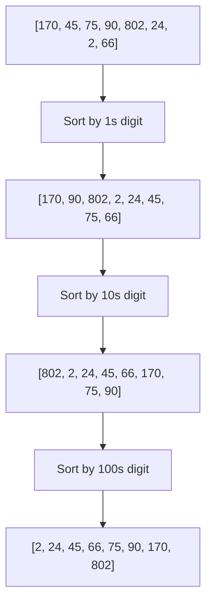

# Radix Sort

## Overview

**Radix Sort** is a non-comparison sorting algorithm that sorts integers or strings by processing individual digits/characters. It uses a stable sub-sort (usually Counting Sort) on each digit position, achieving $O(nk)$ time where $k$ is the number of digits.

## Key Concepts

| Term | Definition |
|------|------------|
| **Radix** | Base of the number system (e.g., 10 for decimal) |
| **Digit** | Individual position being sorted |
| **LSD** | Least Significant Digit first |
| **MSD** | Most Significant Digit first |

## LSD vs MSD

| Aspect | LSD (Least Significant First) | MSD (Most Significant First) |
|--------|-------------------------------|------------------------------|
| Direction | Right to left | Left to right |
| Approach | Iterative | Recursive |
| Stable | ✅ Required | ✅ Required |
| Short strings | Needs padding | Natural handling |
| Best for | Fixed-length integers | Variable-length strings |

## Algorithm Steps (LSD)



1. Find maximum number to determine digit count
2. For each digit position (right to left):
   - Use stable sort (Counting Sort) on current digit
3. After all digits processed, array is sorted

## Complexity Analysis

| Metric | Complexity | Notes |
|--------|------------|-------|
| Time | $O(n \cdot k)$ | $k$ = number of digits/characters |
| Space | $O(n + b)$ | $b$ = base/radix (bucket count) |
| Stable | ✅ Yes | Required for correctness |

> [!INFO] When is Radix Sort $O(n)$?
> When $k = O(1)$ (constant digits). For 32-bit integers with base 256, $k = 4$ passes.

## Pseudocode (LSD with Counting Sort)

```
radixSort(arr):
    maxVal = max(arr)
    exp = 1  # Current digit position

    while maxVal // exp > 0:
        countingSortByDigit(arr, exp)
        exp *= 10

countingSortByDigit(arr, exp):
    output = [0] * len(arr)
    count = [0] * 10  # Base 10

    for num in arr:
        digit = (num // exp) % 10
        count[digit] += 1

    # Cumulative count
    for i = 1 to 9:
        count[i] += count[i-1]

    # Build output (right to left for stability)
    for i = len(arr) - 1 down to 0:
        digit = (arr[i] // exp) % 10
        output[count[digit] - 1] = arr[i]
        count[digit] -= 1

    copy output to arr
```

## Choosing the Radix (Base)

| Base | Passes (32-bit) | Space | Trade-off |
|------|-----------------|-------|-----------|
| 2 | 32 | Small | Many passes |
| 10 | 10 | Small | Common choice |
| 256 | 4 | 256 buckets | Fast, more space |
| 65536 | 2 | 65K buckets | Fastest, most space |

> [!TIP] Optimal Base
> Base 256 (byte-wise) often optimal: only 4 passes for 32-bit integers with good cache behavior.

## When to Use

| Good Fit | Poor Fit |
|----------|----------|
| Integers with bounded range | Floating-point numbers |
| Fixed-length strings | Variable-length complex objects |
| Large $n$, small $k$ | Small $n$ (overhead not worth it) |
| Parallel processing | Comparison-only environments |

## Comparison with Other Sorts

| Aspect | Radix Sort | Quick Sort | Counting Sort |
|--------|------------|------------|---------------|
| Type | Non-comparison | Comparison | Non-comparison |
| Time | $O(nk)$ | $O(n \log n)$ | $O(n + k)$ |
| Best when | $k < \log n$ | General purpose | Small range $k$ |
| Stability | ✅ | ❌ | ✅ |

## Practical Applications

| Application | Why Radix Sort |
|-------------|----------------|
| Suffix arrays | String sorting |
| Database indexing | Fixed-width keys |
| IP address sorting | 4-byte values |
| Card sorting (historical) | Original use case |
| Parallel sorting | Easy to parallelize |

## Handling Negative Numbers

1. **Offset method**: Add minimum to make all positive, sort, subtract
2. **Separate passes**: Sort negatives and positives separately
3. **Sign bit handling**: Process sign bit specially (flip for negatives)

## Related Concepts

- [[72_Algorithms_MOC]]
- [[72.30 Bucket Sort]]
- [[72.18 Sorting Algorithms Comparison]]
- [[72.05 Space and Time Trade-Offs]]
