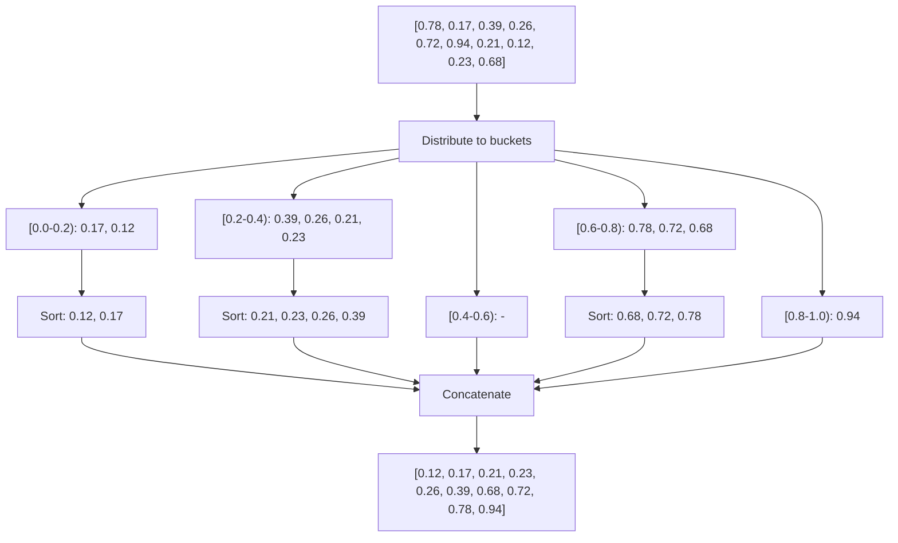

# Bucket Sort

## Overview

**Bucket Sort** distributes elements into a number of buckets, sorts each bucket individually (often with another algorithm), then concatenates the buckets. Achieves $O(n)$ average time when input is **uniformly distributed**.

## Key Concepts

| Term | Definition |
|------|------------|
| **Bucket** | Container for a range of values |
| **Distribution** | Mapping elements to buckets |
| **Uniform input** | Elements evenly spread across range |
| **Sub-sort** | Algorithm used within each bucket |

## Algorithm Visualization



## Algorithm Steps

1. **Create buckets**: $n$ empty buckets for range $[0, 1)$
2. **Distribute**: Place each element in bucket $\lfloor n \cdot \text{value} \rfloor$
3. **Sort buckets**: Use Insertion Sort (or any sort) on each bucket
4. **Concatenate**: Combine all buckets in order

## Complexity Analysis

| Case | Time | When |
|------|------|------|
| Best | $O(n)$ | Uniform distribution |
| Average | $O(n + n^2/k + k)$ | $k$ buckets |
| Worst | $O(n^2)$ | All in one bucket |
| Space | $O(n + k)$ | Elements + buckets |

> [!INFO] Why $O(n)$ Average?
> With uniform distribution and $n$ buckets, expected bucket size is $O(1)$. Sorting each bucket is $O(1)$, and there are $n$ buckets.

## Pseudocode

```
bucketSort(arr, n):
    buckets = [[] for _ in range(n)]

    # Distribute elements
    for value in arr:
        idx = floor(n * value)  # For [0, 1) range
        buckets[idx].append(value)

    # Sort individual buckets
    for bucket in buckets:
        insertionSort(bucket)  # Or any stable sort

    # Concatenate
    result = []
    for bucket in buckets:
        result.extend(bucket)

    return result
```

## Bucket Index Calculation

| Data Range | Bucket Index Formula |
|------------|---------------------|
| $[0, 1)$ | $\lfloor n \cdot x \rfloor$ |
| $[\min, \max]$ | $\lfloor n \cdot \frac{x - \min}{\max - \min} \rfloor$ |
| Integers $[0, k]$ | $\lfloor n \cdot x / k \rfloor$ |

## Number of Buckets

| Choice | Trade-off |
|--------|-----------|
| $k = n$ | Best for uniform, more space |
| $k = \sqrt{n}$ | Balance space/time |
| $k = n / c$ | $c$ elements per bucket expected |

## When to Use

| Good Fit | Poor Fit |
|----------|----------|
| Uniformly distributed floats | Clustered data |
| Known range | Unknown distribution |
| External sorting | General purpose |
| Parallel sorting | Comparison-only environment |

> [!WARNING] Distribution Matters
> Bucket Sort degrades to $O(n^2)$ if elements cluster in few buckets. Know your data distribution!

## Comparison with Related Algorithms

| Algorithm | Best For | Mechanism |
|-----------|----------|-----------|
| **Bucket Sort** | Uniform floats | Distribute by range |
| **Counting Sort** | Small integer range | Count occurrences |
| **Radix Sort** | Fixed-digit integers | Digit-by-digit |

## Variants

| Variant | Description |
|---------|-------------|
| **Proxmap Sort** | Uses proximity mapping function |
| **Histogram Sort** | Pre-counts bucket sizes |
| **Sample Sort** | Parallel bucket sort with sampling |
| **Flash Sort** | Classification-based distribution |

## Practical Applications

| Application | Why Bucket Sort |
|-------------|-----------------|
| Floating-point sorting | Natural fit for $[0, 1)$ |
| External sorting | Distribute to disk buckets |
| Parallel sorting | Buckets processed independently |
| Histogram creation | Bucket counts directly usable |

## Stability

Bucket Sort is **stable** if:
1. Distribution preserves insertion order
2. Sub-sort algorithm is stable
3. Concatenation preserves order

Using Insertion Sort as sub-sort maintains stability.

## Related Concepts

- [[72_Algorithms_MOC]] - Parent category
- [[72.29 Radix Sort]] - Related: digit-based distribution
- [[72.26 Insertion Sort]] - Commonly used as in-bucket sort
- [[72.18 Sorting Algorithms Comparison]] - Context: O(n) for uniform distribution
