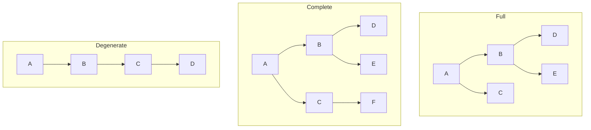

# Binary Tree

## Overview

A **Binary Tree** is a hierarchical data structure where each node has at most **two children** (left and right). It forms the foundation for BSTs, heaps, expression trees, and many divide-and-conquer algorithms.

## Key Concepts

| Term | Definition |
|------|------------|
| **Root** | Top node with no parent |
| **Leaf** | Node with no children |
| **Height** | Longest path from root to leaf |
| **Depth** | Distance from root to node |
| **Level** | All nodes at same depth |
| **Subtree** | Node and all its descendants |

## Tree Properties

| Property | Formula |
|----------|---------|
| Max nodes at level $l$ | $2^l$ |
| Max nodes in tree height $h$ | $2^{h+1} - 1$ |
| Min height for $n$ nodes | $\lfloor \log_2 n \rfloor$ |
| Leaves in full tree | $(n + 1) / 2$ |

## Binary Tree Types

| Type | Definition | Properties |
|------|------------|------------|
| **Full** | Every node has 0 or 2 children | No single-child nodes |
| **Complete** | All levels filled except last (left-aligned) | Used in heaps |
| **Perfect** | All internal nodes have 2 children, all leaves same level | $2^{h+1} - 1$ nodes |
| **Balanced** | Height difference of subtrees ≤ 1 | $O(\log n)$ operations |
| **Degenerate** | Each node has only one child | Essentially a linked list |

## Binary Search Tree (BST)

A binary tree with the **BST property**: left subtree < node < right subtree.

| Operation | Average | Worst (Unbalanced) |
|-----------|---------|---------------------|
| Search | $O(\log n)$ | $O(n)$ |
| Insert | $O(\log n)$ | $O(n)$ |
| Delete | $O(\log n)$ | $O(n)$ |

> [!WARNING] Worst Case
> Inserting sorted data into BST creates a degenerate tree. Use self-balancing trees (AVL, Red-Black) for guaranteed $O(\log n)$.

## Self-Balancing Trees

| Tree Type | Balance Condition | Rotation Types |
|-----------|-------------------|----------------|
| **AVL Tree** | Height diff ≤ 1 | Single, Double |
| **Red-Black** | Color properties | Recolor, Rotate |
| **B-Tree** | Multi-way, disk-optimized | Split, Merge |
| **Splay Tree** | Recently accessed at root | Zig, Zig-Zig, Zig-Zag |

## Common Operations

| Operation | Description |
|-----------|-------------|
| **Insert** | Find correct position, add leaf |
| **Delete** | Handle 0, 1, or 2 children cases |
| **Search** | Compare and go left/right |
| **Traversal** | Visit all nodes in specific order |
| **Height** | Max depth of any leaf |
| **LCA** | Lowest Common Ancestor |

## Special Binary Trees

| Type | Description | Use Case |
|------|-------------|----------|
| **Expression Tree** | Operators at internal nodes, operands at leaves | Compilers |
| **Huffman Tree** | Frequency-based encoding | Compression |
| **Segment Tree** | Range queries and updates | Competitive programming |
| **Binary Indexed Tree** | Prefix sums with updates | Range sum queries |

## Array Representation

For **complete** binary trees (like heaps):

| Node | Index |
|------|-------|
| Root | 0 |
| Parent of $i$ | $(i - 1) / 2$ |
| Left child of $i$ | $2i + 1$ |
| Right child of $i$ | $2i + 2$ |

## Practical Use Cases

| Application | Tree Type |
|-------------|-----------|
| Database indexing | B-Tree, B+ Tree |
| In-memory sorted data | AVL, Red-Black |
| Priority queues | Binary Heap |
| Autocomplete | Trie (n-ary tree) |
| File systems | N-ary tree |
| Decision making | Decision Tree |

## Related Concepts

- [[72_Algorithms_MOC]] - Parent category
- [[72.14 Tree Traversals]] - Algorithms for visiting nodes
- [[72.16 Heap and Priority Queue]] - Complete binary tree application
- [[72.13 Graph Algorithms]] - Trees as special case of graphs
- [[72.23 Binary Search]] - Uses BST for O(log n) search
