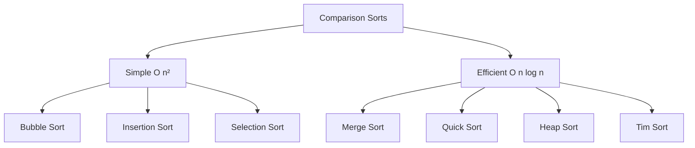

# Comparison Sorting Algorithms

## Overview

**Comparison-based sorting** algorithms determine element order solely by comparing pairs of elements. They have a theoretical lower bound of $\Omega(n \log n)$ comparisons in the worst case, proven via decision tree analysis.

## Key Concepts

| Term | Definition |
|------|------------|
| **Comparison** | Binary decision: is $a < b$? |
| **Decision tree** | All possible comparison sequences |
| **Lower bound** | Minimum comparisons needed: $\lceil \log_2(n!) \rceil$ |
| **Optimal** | Achieves $O(n \log n)$ worst case |

## Why $\Omega(n \log n)$?

There are $n!$ permutations of $n$ elements. Each comparison is a binary decision, so a decision tree has at most $2^h$ leaves at height $h$.

$$2^h \geq n! \implies h \geq \log_2(n!) \approx n \log n$$

> [!INFO] Stirling's Approximation
> $\log_2(n!) \approx n \log_2 n - n \cdot \log_2 e \approx n \log_2 n$

## Comparison Sorting Algorithms

| Algorithm | Best | Average | Worst | Space | Stable |
|-----------|------|---------|-------|-------|--------|
| **Bubble Sort** | $O(n)$ | $O(n^2)$ | $O(n^2)$ | $O(1)$ | ✅ |
| **Insertion Sort** | $O(n)$ | $O(n^2)$ | $O(n^2)$ | $O(1)$ | ✅ |
| **Selection Sort** | $O(n^2)$ | $O(n^2)$ | $O(n^2)$ | $O(1)$ | ❌ |
| **Merge Sort** | $O(n \log n)$ | $O(n \log n)$ | $O(n \log n)$ | $O(n)$ | ✅ |
| **Quick Sort** | $O(n \log n)$ | $O(n \log n)$ | $O(n^2)$ | $O(\log n)$ | ❌ |
| **Heap Sort** | $O(n \log n)$ | $O(n \log n)$ | $O(n \log n)$ | $O(1)$ | ❌ |
| **Tim Sort** | $O(n)$ | $O(n \log n)$ | $O(n \log n)$ | $O(n)$ | ✅ |

## Classification

## Trade-off Matrix

| Priority | Best Choice | Why |
|----------|-------------|-----|
| Guaranteed $O(n \log n)$ | Merge Sort, Heap Sort | No worst-case degradation |
| Minimal space | Heap Sort | $O(1)$ auxiliary |
| Stability | Merge Sort, Tim Sort | Preserves equal order |
| Cache performance | Quick Sort | Sequential access |
| Nearly sorted data | Tim Sort, Insertion Sort | Adaptive $O(n)$ |
| Simple implementation | Insertion Sort | Few lines of code |

## When to Choose

| Scenario | Algorithm | Reason |
|----------|-----------|--------|
| General purpose | Tim Sort / Quick Sort | Balanced performance |
| External sorting | Merge Sort | Sequential I/O |
| Embedded systems | Heap Sort | Predictable, in-place |
| Small arrays ($n < 50$) | Insertion Sort | Low overhead |
| Linked lists | Merge Sort | No random access needed |

## Comparison vs Non-Comparison

| Aspect | Comparison | Non-Comparison |
|--------|------------|----------------|
| Lower bound | $\Omega(n \log n)$ | $O(n)$ possible |
| Input type | Any comparable | Integers, strings |
| Examples | Quick, Merge, Heap | Counting, Radix, Bucket |
| General purpose | ✅ | Limited applicability |

> [!TIP] Hybrid Approach
> Production sorts (Tim Sort, Introsort) combine multiple algorithms: use Insertion Sort for small subarrays, switch strategies when performance degrades.

## Related Concepts

- [[72_Algorithms_MOC]]
- [[72.33 Non-Comparison Sorting Algorithms]]
- [[72.18 Sorting Algorithms Comparison]]
- [[72.21 Quick Sort]]
- [[72.22 Merge Sort]]
- [[72.24 Heap Sort]]
