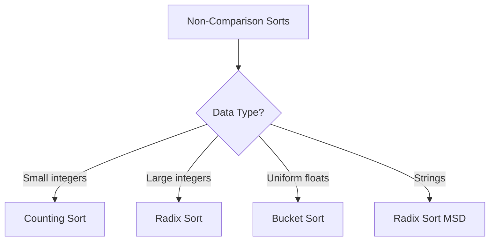

# Non-Comparison Sorting Algorithms

## Overview

**Non-comparison sorting** algorithms sort without comparing elements directly. By exploiting properties of the data (integer keys, bounded range), they achieve $O(n)$ time complexity, breaking the $\Omega(n \log n)$ comparison sort barrier.

## Key Concepts

| Term | Definition |
|------|------------|
| **Key-indexed** | Use keys directly as indices |
| **Stable** | All non-comparison sorts are typically stable |
| **Linear time** | $O(n)$ or $O(nk)$ where $k$ is constant |
| **Limited domain** | Only works for specific data types |

## Algorithm Comparison

| Algorithm | Time | Space | Best For |
|-----------|------|-------|----------|
| **Counting Sort** | $O(n + k)$ | $O(k)$ | Small integer range $k$ |
| **Radix Sort** | $O(n \cdot d)$ | $O(n + b)$ | Fixed-width integers, strings |
| **Bucket Sort** | $O(n)$ avg | $O(n + k)$ | Uniformly distributed floats |

Where: $k$ = range, $d$ = digits, $b$ = base/buckets

## When Non-Comparison Beats Comparison

Non-comparison is faster when:
$$k < n \log n \text{ (Counting)} \quad \text{or} \quad d < \log n \text{ (Radix)}$$

| Data Type | Condition | Best Algorithm |
|-----------|-----------|----------------|
| Integers $[0, k]$ | $k = O(n)$ | Counting Sort |
| 32-bit integers | Always | Radix Sort (base 256, 4 passes) |
| Floats $[0, 1)$ | Uniform distribution | Bucket Sort |
| Strings (fixed length) | Same length | Radix Sort (MSD) |

## Counting Sort

**Idea**: Count occurrences, compute cumulative positions.

```
countingSort(arr, k):
    count = [0] * (k + 1)
    for x in arr: count[x] += 1
    for i in 1..k: count[i] += count[i-1]

    output = [0] * len(arr)
    for x in reversed(arr):  # Reverse for stability
        output[count[x] - 1] = x
        count[x] -= 1
    return output
```

| Pros | Cons |
|------|------|
| $O(n + k)$ time | $O(k)$ space |
| Stable | Only for integers |
| Simple | Impractical if $k >> n$ |

## Radix Sort

**Idea**: Sort digit by digit using stable sort (Counting Sort).

| Variant | Direction | Best For |
|---------|-----------|----------|
| **LSD** | Least → Most significant | Fixed-length integers |
| **MSD** | Most → Least significant | Variable-length strings |

```
radixSortLSD(arr):
    for digit in [1s, 10s, 100s, ...]:
        stableSort(arr, by=digit)
```

| Pros | Cons |
|------|------|
| $O(nd)$ where $d$ often constant | Not in-place |
| Handles large numbers | Requires stable sub-sort |
| Parallelizable | Overhead for small $n$ |

## Bucket Sort

**Idea**: Distribute to buckets, sort buckets, concatenate.

```
bucketSort(arr):  # arr in [0, 1)
    buckets = [[] for _ in range(n)]
    for x in arr:
        buckets[floor(n * x)].append(x)
    for bucket in buckets:
        insertionSort(bucket)
    return concatenate(buckets)
```

| Pros | Cons |
|------|------|
| $O(n)$ average | $O(n^2)$ worst (clustering) |
| Works for floats | Requires uniform distribution |
| Parallelizable | Extra space for buckets |

## Comparison Summary



## Hybrid Applications

| System | Approach |
|--------|----------|
| **Database sorting** | Radix for integer keys, comparison for general |
| **String sorting** | MSD Radix + Insertion for short strings |
| **External sorting** | Bucket to distribute, merge phases |

## Limitations

| Limitation | Impact |
|------------|--------|
| Data type restricted | Only integers, fixed strings, floats |
| Space overhead | Often $O(n + k)$ |
| Not comparison-based | Can't use custom comparators |
| Distribution dependent | Bucket sort degrades on skewed data |

> [!WARNING] When NOT to Use
> - Unknown or unbounded key range
> - Complex objects with custom ordering
> - Memory-constrained environments
> - Small datasets (overhead not worth it)

## Related Concepts

- [[72_Algorithms_MOC]] - Parent category
- [[72.32 Comparison Sorting Algorithms]] - Contrast: O(n log n) lower bound
- [[72.29 Radix Sort]] - Linear time for integer keys
- [[72.30 Bucket Sort]] - Linear time for uniform floats
- [[72.18 Sorting Algorithms Comparison]] - When to use non-comparison sorts
