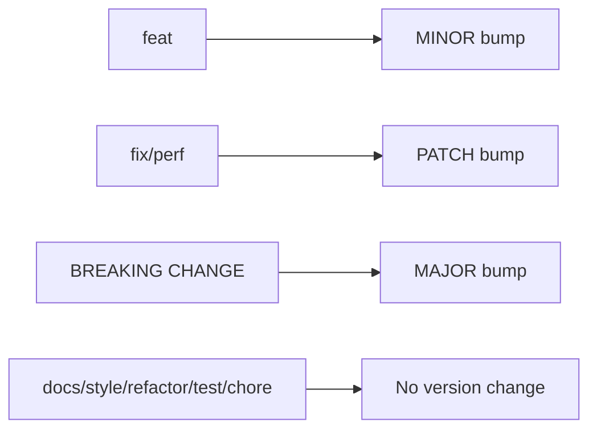

# Conventional Commits

## Overview
Conventional Commits is a specification for writing standardized commit messages. It provides a lightweight convention that creates an explicit commit history, enabling automated tooling for versioning, changelog generation, and release management.

## Format
```
<type>[optional scope]: <description>

[optional body]

[optional footer(s)]
```

## Commit Types

| Type | Description | SemVer |
|------|-------------|--------|
| `feat` | New feature | MINOR |
| `fix` | Bug fix | PATCH |
| `docs` | Documentation only | - |
| `style` | Formatting, whitespace | - |
| `refactor` | Code change (no feat/fix) | - |
| `perf` | Performance improvement | PATCH |
| `test` | Adding/fixing tests | - |
| `build` | Build system, dependencies | - |
| `ci` | CI/CD configuration | - |
| `chore` | Maintenance tasks | - |
| `revert` | Revert previous commit | - |

## Breaking Changes
Indicate breaking changes with:
1. `!` after type/scope: `feat!: remove deprecated API`
2. Footer: `BREAKING CHANGE: description`

Both trigger a MAJOR version bump.

## Examples

### Basic
```
feat: add user authentication
fix: resolve memory leak in cache
docs: update API documentation
```

### With Scope
```
feat(auth): implement OAuth2 login
fix(api): handle null response correctly
refactor(db): optimize query performance
```

### With Body
```
feat(parser): add support for arrays

Arrays can now be parsed using the new ArrayParser class.
Supports nested arrays and mixed types.
```

### Breaking Change
```
feat(api)!: change response format to JSON:API

BREAKING CHANGE: All endpoints now return JSON:API formatted responses.
Clients must update their parsers accordingly.
```

### With Multiple Footers
```
fix(auth): prevent session fixation attack

Regenerate session ID after successful login.

Reviewed-by: Alice
Refs: #123, #456
```

## Benefits

| Benefit | Description |
|---------|-------------|
| **Automated versioning** | SemVer from commit types |
| **Changelog generation** | Auto-generate from history |
| **Clear history** | Scannable commit log |
| **Team alignment** | Shared vocabulary |
| **CI/CD integration** | Trigger workflows by type |

## Tooling

### Commit Linting
```bash
# Install commitlint
npm install -D @commitlint/cli @commitlint/config-conventional

# commitlint.config.js
module.exports = { extends: ['@commitlint/config-conventional'] };
```

### Git Hooks (Husky)
```bash
npm install -D husky
npx husky init
echo "npx --no -- commitlint --edit \$1" > .husky/commit-msg
```

### Semantic Release
```bash
npm install -D semantic-release
```

Automates:
- Version bumping
- Changelog generation
- Git tagging
- Package publishing

### Commitizen (Interactive)
```bash
npm install -D commitizen cz-conventional-changelog
npx commitizen init cz-conventional-changelog --save-dev --save-exact
```

Use `git cz` for guided commit messages.

## Scope Guidelines
- Keep scopes consistent within project
- Use lowercase
- Common scopes: `api`, `auth`, `db`, `ui`, `config`, `deps`

## Best Practices
1. **Imperative mood**: "add feature" not "added feature"
2. **Lowercase type**: `feat` not `Feat`
3. **No period**: End description without `.`
4. **50/72 rule**: Subject ≤50 chars, body wrap at 72
5. **Atomic commits**: One logical change per commit
6. **Reference issues**: Link to tickets in footer

## Integration with SemVer



## Related Concepts
- [[74.02 pre-commit]] - Git hooks framework
- [[73.02 Docker]] - CI/CD workflows
- Semantic Versioning (SemVer)
- Git Hooks
- Release Automation

## References
- [Conventional Commits Spec](https://www.conventionalcommits.org/)
- [Angular Commit Guidelines](https://github.com/angular/angular/blob/main/CONTRIBUTING.md#commit)
- [Commitlint](https://commitlint.js.org/)
- [Semantic Release](https://semantic-release.gitbook.io/)
