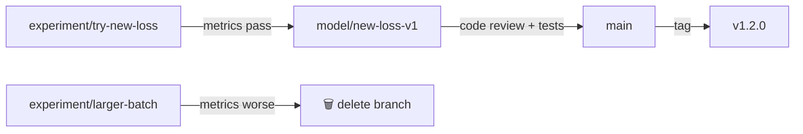

# Git Branch Management for DS/ML

## Overview
**Branch management for Data Science and ML** differs from traditional software engineering because ML projects involve **experiments**, **data versions**, **model artifacts**, and **notebooks** alongside application code. A good branching strategy keeps experiments traceable without polluting the main codebase.

## Recommended Branch Structure

```
main ─────────────────────────────── production-ready, tagged releases
 ├── develop ─────────────────────── integration branch (optional)
 ├── feature/add-auth-endpoint ───── traditional software features
 ├── experiment/bert-finetune-v2 ─── ML experiments (may never merge)
 ├── data/update-training-set-q4 ─── data pipeline / schema changes
 └── model/retrain-churn-v3 ──────── model retraining / promotion
```

## Branch Naming Convention

| Prefix | Purpose | Example |
|---|---|---|
| `feature/` | Application code, API, infra | `feature/add-prediction-endpoint` |
| `experiment/` | ML experiments (throwaway OK) | `experiment/xgboost-vs-lightgbm` |
| `data/` | Data pipeline, schema, ETL changes | `data/add-clickstream-source` |
| `model/` | Model retraining, promotion | `model/retrain-fraud-v4` |
| `hotfix/` | Urgent production fixes | `hotfix/fix-inference-oom` |
| `notebook/` | Exploratory notebooks (optional) | `notebook/eda-user-churn` |

> [!TIP] Use `experiment/` for branches you expect to abandon
> Most ML experiments fail. Prefixing with `experiment/` signals that the branch may never merge, making cleanup easier.

## Workflow: ML Experiment → Production



1. **Experiment** — Branch off `main`, iterate freely, track with MLflow/W&B
2. **Promote** — If metrics pass, create `model/` branch with clean commits
3. **Review** — PR with model card, metrics comparison, test coverage
4. **Merge** — Squash-merge into `main`, tag release

## What Goes Where

| Artifact | Git? | Where Instead |
|---|---|---|
| Source code | ✅ Git | — |
| Config / hyperparams | ✅ Git | — |
| Small notebooks (<1MB) | ✅ Git | — |
| Training data | ❌ | DVC, S3, GCS |
| Model weights | ❌ | MLflow, model registry |
| Large notebooks (outputs) | ❌ | Clear outputs before commit |
| Experiment logs | ❌ | MLflow, W&B |

> [!WARNING] Never commit large binary files
> Model weights, datasets, and checkpoint files bloat the repo permanently. Use **DVC** or **Git LFS** if you must version them alongside code.

## Protecting `main` for ML Projects

| Rule | Why |
|---|---|
| Require PR reviews | Prevent untested model code in production |
| CI: unit + integration tests | Catch broken pipelines before merge |
| CI: model validation gate | Ensure metrics don't regress (e.g., accuracy > threshold) |
| No direct notebook pushes | Notebooks with outputs cause merge conflicts |
| Squash merge | Keep history clean (experiments are messy) |

## Cleanup Strategy
- **Delete merged branches** automatically via GitHub settings
- **Prune stale `experiment/` branches** monthly (>30 days with no commits)
- **Archive** successful experiment metadata in MLflow, not in Git branches

## Comparison: Branching Models for ML

| Model | Best For | Complexity |
|---|---|---|
| **GitHub Flow** + experiment prefix | Small ML teams, fast iteration | Low |
| **GitFlow** + experiment/model prefix | Larger teams, scheduled releases | Medium |
| **Trunk-based** + feature flags | CI/CD heavy, A/B testing models | High |

> [!TIP] Start simple
> For most ML teams, **GitHub Flow** (main + short-lived branches) with `experiment/` and `model/` prefixes is enough. Add complexity only when needed.

## Related Concepts
- [[74_Git_Workflows_MOC]] - Parent category
- [[74.01 Conventional Commits]] - Commit message standard for ML repos
- [[74.02 pre-commit]] - Automate notebook cleanup and linting
- [[12.10 MLflow]] - Track experiments referenced by branch name
