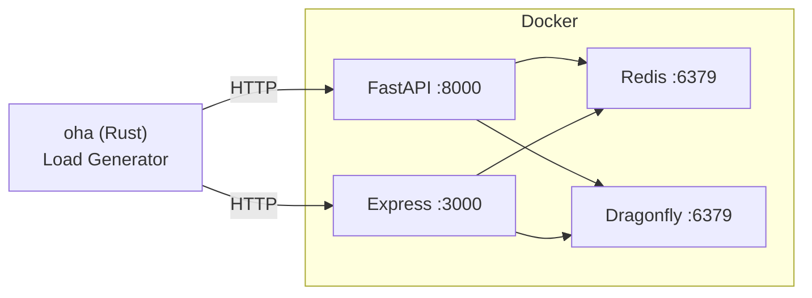

# perf-api-framework

## Overview
**perf-api-framework** is a personal API stress-testing and benchmarking framework that compares **FastAPI** (Python) vs **Express.js** (Node.js) backed by **Redis** (single-threaded) vs **Dragonfly** (multi-threaded) under controlled load. It produces an interactive HTML dashboard with Plotly charts.

🔗 **Repo**: [github.com/LCKYN/perf-api-framework](https://github.com/LCKYN/perf-api-framework)

## Architecture



- **oha** runs on the host, sends rate-limited HTTP requests into Docker containers
- Each combo of framework × datastore × workers is tested in isolation with CPU pinning

## Test Matrix

| Dimension | Values |
|---|---|
| Frameworks | FastAPI, Express.js |
| Data Stores | Redis 7, Dragonfly |
| Workers | 1, 2, 4 |
| Concurrency | 100, 500, 1,000, 2,000 |
| Target QPS | 1k, 5k, 10k, 20k (rate-limited) |
| Repetitions | 5 per config |
| Duration | 20s per test |

**Total: 960 tests (~6 hours full matrix)**

## Key Design Decisions
- **Rate-limited ramp** (not max-blast) — uses `oha --latency-correction` to avoid Coordinated Omission Problem
- **Endpoint**: `GET /cached-value` reads a pre-seeded 1KB Redis key — isolates framework + datastore path
- **CPU isolation**: Docker `cpus` limits scale with worker count (1/2/4 CPUs for API, fixed 2 CPUs for DB)
- **Statistical stability**: 5 repetitions per config → mean ± stddev in reports

## Report Charts
1. **Actual RPS vs Target QPS** — where does throughput plateau?
2. **p95 Latency vs Target QPS** — hockey-stick detection
3. **RPS vs Workers** — linear scalability check
4. **Redis vs Dragonfly** — single-threaded bottleneck at max workers

## Usage

```bash
# Smoke test (~30s)
./scripts/benchmark.sh --quick

# Full matrix (~6h)
./scripts/benchmark.sh

# View results
open results/report.html
```

> [!INFO] Prerequisites
> Docker Desktop (8GB RAM, 8+ CPUs), oha (`brew install oha`), Python 3.10+ with `plotly` and `pandas`.

## Project Structure

| Path | Purpose |
|---|---|
| `fastapi/app.py` | Async FastAPI endpoint (Gunicorn + Uvicorn workers) |
| `express/app.js` | Express.js endpoint (Node.js cluster) |
| `scripts/benchmark.sh` | Main orchestration — iterates full permutation matrix |
| `scripts/seed.sh` | Pre-populate Redis/Dragonfly with test data |
| `scripts/parse_results.py` | oha JSON → CSV parser with averaging |
| `report/generate_report.py` | CSV → self-contained HTML dashboard (Plotly) |

## Related Concepts
- [[75_Dev_Tools_MOC]] - Parent category
- [[31.02 Serving Architecture]] - What this benchmarks: API serving patterns
