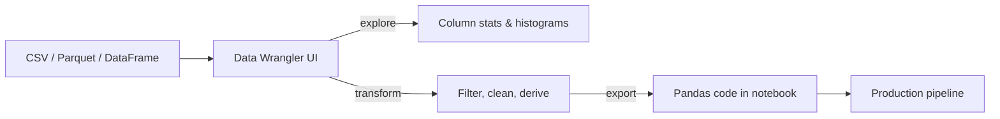

# Data Wrangler

## Overview
**Data Wrangler** is a VS Code extension by Microsoft for **interactive data exploration, cleaning, and transformation** of tabular data. It provides a spreadsheet-like UI inside VS Code with auto-generated Python/Pandas code for every operation — bridging the gap between GUI data tools and reproducible scripts.

## Key Features

| Feature | Description |
|---|---|
| **Data grid viewer** | Spreadsheet-like view for DataFrames, CSV, Parquet |
| **Column statistics** | Histogram, missing %, data type, min/max per column |
| **Filter & sort** | Click-based filtering with auto-generated code |
| **Code generation** | Every UI action produces Pandas code you can export |
| **In-notebook support** | Inspect DataFrames directly from Jupyter notebooks |
| **Large file support** | Handles files up to ~1GB with virtual scrolling |

## How to Open

| Method | Steps |
|---|---|
| **From file** | Right-click `.csv` / `.parquet` → *Open with Data Wrangler* |
| **From notebook** | Click the *Data Wrangler* icon next to a DataFrame variable |
| **From command palette** | `Ctrl+Shift+P` → *Data Wrangler: Open* |

## Supported Operations

| Category | Operations |
|---|---|
| **Filter** | By value, condition, top N, regex |
| **Sort** | Ascending/descending, multi-column |
| **Transform** | Rename, reorder, change dtype, fill missing |
| **Clean** | Drop duplicates, drop nulls, strip whitespace |
| **Derive** | New column from expression, split column |
| **Aggregate** | Group by + sum/mean/count |

> [!TIP] Every operation generates code
> After applying transforms in the UI, click **Export to notebook** to get clean, reproducible Pandas code. This makes Data Wrangler ideal for **prototyping transformations** before committing to a pipeline.

## Workflow

## Data Wrangler vs Alternatives

| Tool | Environment | Code Gen | Large Files | Free |
|---|---|---|---|---|
| **Data Wrangler** | VS Code | ✅ Pandas | ✅ ~1GB | ✅ |
| **Excel** | Desktop | ❌ | ❌ ~1M rows | 💰 |
| **Google Sheets** | Browser | ❌ | ❌ ~10M cells | ✅ |
| **Bamboolib** | Jupyter | ✅ Pandas | ⚠️ Medium | 💰 |
| **dtale** | Browser | ✅ Pandas | ⚠️ Medium | ✅ |

## Practical Use Cases
- **EDA (Exploratory Data Analysis)** — Quick column stats and distributions before writing code
- **Data cleaning** — Visually identify and fix nulls, duplicates, type mismatches
- **CSV/Parquet inspection** — Browse large files without loading into a notebook
- **Prototyping transforms** — Build transforms in UI, export as reproducible Pandas code
- **Onboarding** — Quickly understand unfamiliar datasets

## Related Concepts
- [[75_Dev_Tools_MOC]] - Parent category
- [[75.01 VS Code]] - Host editor for Data Wrangler extension
